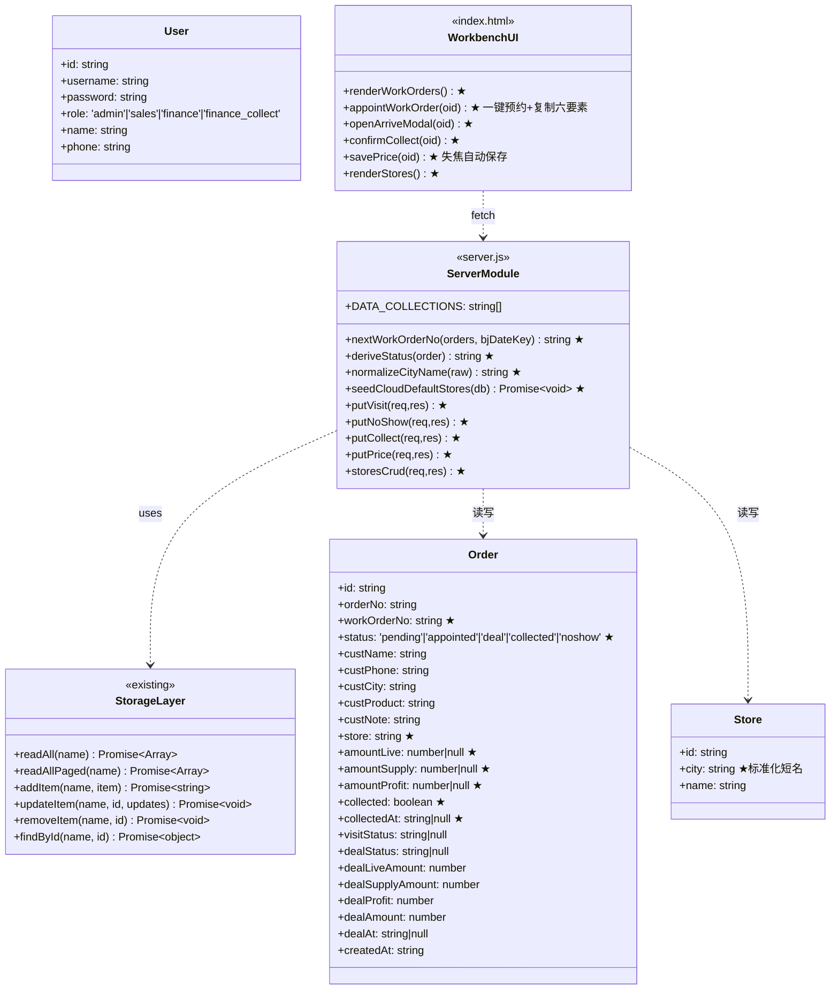
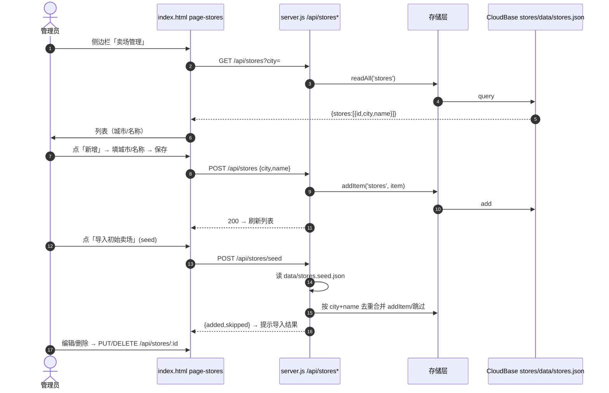
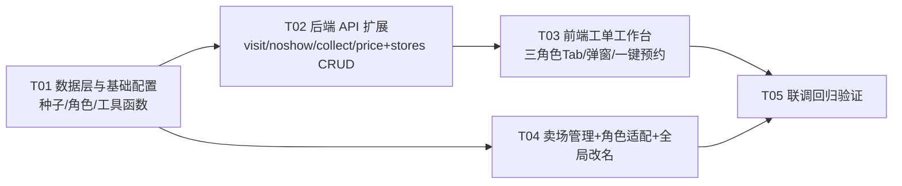

# 销售订单系统 — 「订单→工单」增量改造 系统设计 + 任务分解

| 项 | 内容 |
| --- | --- |
| 文档类型 | 增量系统设计（非新建项目） |
| 上游输入 | 主理人转发的终版蓝图（已确认 PRD 要点） |
| 编写人 | Bob（架构师） |
| 项目路径 | `C:\Users\Administrator\WorkBuddy\2026-08-06-11-39-03\sales-order-system\` |
| 技术栈 | Node.js + Express 4 + 原生 JS 单文件 SPA + ECharts(本地) + CloudBase(云端)/JSON(本地)，无构建步骤 |

> 本文档以「最小变更」为铁律：不改数据表/接口命名（仍叫 orders）、不动已迁移数据与迁移脚本、
> 保持云端/本地双模式、前端仍是单文件。所有设计点均已对照现有代码核实（行号/函数名/路由名真实存在）。

---

# Part A：系统设计

## 1. 实现方案 + 框架选型

### 1.1 总体结论
- **不新增任何框架/依赖**。沿用现有栈：Express 4 后端 + `public/index.html` 单文件 SPA + CloudBase 文档库（云端）/ `data/*.json`（本地）。
- 本次增量 = 「后端加 4 个新状态流转路由 + stores 集合 + 3 个工具函数」+「前端新增工单工作台（三角色共用一套 Tab）+ 卖场管理页 + 全局文案改名」。
- 无构建、无编译，`server.js` 直接 `node` 运行。

### 1.2 核心难点与对策
| 难点 | 对策 |
| --- | --- |
| 既有状态是 `visitStatus/dealStatus` 双字段，新需求是 5 态单枚举 `status` | 新增 `status` 为**权威字段**，`visitStatus/dealStatus/collected/dealAmount` 保留并**同步镜像**。这样看板(`/api/stats`)、地图(`/api/mapStats`、`/api/cityStats`)、导出(`excel.js`)、导入去重(**orderNo 唯一**)全部**零改动** |
| 存量 2 条老订单无 `status` | 服务端 `deriveStatus(o)` 由旧字段推导；前端展示 `workOrderNo || orderNo`，不回填 |
| 工单号当日自增，多实例并发可能重号 | 工单号生成只放 **server.js**，仿照现有 `suggestionQueue` 用**串行队列** `workOrderNoQueue` 保证唯一 |
| 云端首次部署无 stores 集合 | `stores` 进 `DATA_COLLECTIONS`（自动建集合），本地 `initLocal` 加文件表；种子文件 `data/stores.seed.json` 常驻仓库（需 .gitignore 例外），首次启动/「导入初始卖场」按钮合并写入 |
| 前端 897 行单文件，全局改名易误伤 | 改名只动**用户可见中文文案**，API 路径/字段名/DOM id/CSS 类/函数名一律不动（见 1.3 禁改清单） |
| 城市识别命中「甘肃兰州」等带省前缀值 | 卖场种子 city 全部用**标准化短名**（兰州/镇江/泰州…）；`phoneCity.js` 的 `areaCodeMap` 补缺失号段（镇江 0511、泰州 0523 等） |

### 1.3 前端「订单→工单」改名策略
**做法**：仅替换用户可见中文（标题、导航、按钮、表头、提示、弹窗），按下面 6 组定点替换 + 人工核对；**禁用**盲目的全文件字符串替换。

**要改的位置（对照真实代码）**
1. `<title>`、登录页文案（`loginPage` 区块）
2. `buildNav()` 导航：`订单管理→工单管理`、`我的订单→我的工单`、`确认成交→工单处理`（按角色）
3. `switchPage()` 的 `pageTitle` 映射表与 `headerActions` 按钮 `+ 新建订单→+ 新建工单`
4. 订单页：`ordersTitle`「全部订单→全部工单」、`filterStatus`、`searchOrder` placeholder「搜索客户/订单号→搜索电话/工单号/品种/城市」
5. 看板 `loadDashboard()`、地图 `loadCityMap()` 的卡片/图例文案（新增工单/成交工单/近7天工单趋势/工单量/城市TOP(工单量)）
6. `reportOrder()` 提示「已复制，状态已改为即将到店→工单信息已复制去微信报单吧」
7. 数据管理页（导出 Excel/导入弹窗/备份）文案中的「订单」

**❌ 严禁误改（保留原样）**
- API 路径：`/api/orders`、`/api/stats`、`/api/mapStats`、`/api/cityStats`、`/api/export*`、`/api/import/*`
- 字段名：`orderNo`、`custName`、`custPhone`、`custCity`、`custProduct`、`custNote`、`storeAddress`、`visitStatus`、`dealStatus`、`dealAmount`、`dealLiveAmount`、`dealSupplyAmount`、`dealProfit`、`salesPersonId`、`createdAt`、`id`
- DOM id / CSS 类：`page-orders`、`page-finance-follow`、`ordersTitle`、`dealModal`、`role-tag` 等
- JS 函数名/变量名；`excel.js` 表头（导入模板兼容性，**不动**）
- 注释内文字可不动（省事且零风险）

---

## 2. 文件列表

| 文件 | 动作 | 说明 |
| --- | --- | --- |
| `server.js` | 修改 | ①`DATA_COLLECTIONS` 加 `'stores'`；②`initLocal()` files 表加 `stores:'stores.json'`；③新增工具函数 `nextWorkOrderNo`/`deriveStatus`/`normalizeCityName` + 串行队列 `workOrderNoQueue`；④`POST /api/orders` 校验改「电话+意向品种」、生成 `workOrderNo`(GD)/`status='pending'`/`store`+镜像/`amount*`；⑤`POST /api/orders/:id/report` 追加写 `status='appointed'`；⑥旧 `POST /visit|deal|follow` 追加 status 镜像 + 防串改守卫（body 带 `status/amount*` 即 400）；⑦新增 `PUT /visit`、`PUT /noshow`、`PUT /collect`、`PUT /price` 路由；⑧新增 stores CRUD + seed 路由；⑨`GET /api/orders` 可见性按角色+`deriveStatus`；⑩`PUT /api/users` 支持改 role、`POST /api/users` role 白名单；⑪启动 IIFE 增加 `seedCloudDefaultStores()`（云端空 stores 时播种） |
| `public/index.html` | 修改 | ①全局改名（1.3）；②新增 `page-workorders` 区块（三角色共用 Tab 组件）+ `renderWorkOrders()`/`loadWorkOrders()`/`openWorkOrderCreate()`/`saveWorkOrder()`/`appointWorkOrder()`(一键预约+复制)/`markNoShow()`/`openArriveModal()`/`saveArrive()`/`confirmCollect()`/`savePrice()` 等；③新增 `woModal`/`arriveModal` 弹窗；④新增 `page-stores` 卖场管理 + `loadStores()`/`openStoreModal()`/`saveStore()`/`delStore()`/`seedStores()`；⑤`buildNav()`/`switchPage()`/`showApp()`/`loadUsers()`/`saveUser()` 适配 `finance_collect` 角色与落地页 |
| `config.js` | 修改 | `defaultUsers` 增加 `finance_collect` 演示账号（如 `{id:'u4',username:'collect',password:'collect123',role:'finance_collect',name:'财务收款'}`） |
| `phoneCity.js` | 修改 | `areaCodeMap` 补充缺失号段：`0511:'镇江'`、`0523:'泰州'` 等（保证种子 city 标准化值可被识别命中） |
| `data/stores.seed.json` | **新增** | 约 200 条卖场种子，结构 `[{id:'s1',city:'武汉',name:'武汉建设银行'},...]`，city 为标准化短名；**必须提交到 git**（见共享知识） |
| `data/users.json` | 修改 | 追加 finance_collect 本地账号一条（与 config 一致），保证本地可直接登录 |
| `.gitignore` | 修改 | 追加 `!data/stores.seed.json`（默认 `data/*.json` 会吞掉种子文件，不例外则云端无初始卖场） |
| `docs/sequence-diagram.mermaid` | 新增 | 本增量四条时序图 |
| `docs/class-diagram.mermaid` | 新增 | 本增量类图 |
| 不动的文件 | — | `excel.js`、`migrate-to-cloud.js`、`data/orders.json`（存量 2 条）、`data-backup-*`、`public/echarts.min.js`、`public/china.json` |

> 说明：`data/stores.json` 是运行时本地存储（gitignore 排除）；`data/stores.seed.json` 是种子（需入库）。云端部署后两者分离，seed 通过「导入初始卖场」或首次启动合并。

---

## 3. 数据结构与接口变更

### 3.1 orders 文档（增量字段；权威=status，双写镜像旧字段）
```jsonc
{
  "id": "ORD...",                     // 既有
  "orderNo": "SO202608060001",        // 既有，导入去重唯一键，不动
  "workOrderNo": "GD20260807-0001",   // ★新增：仅新建生成，旧单不回填
  "status": "pending",                // ★新增：pending|appointed|deal|collected|noshow
  "store": "武汉建设银行",              // ★新增：预约卖场（镜像 storeAddress）
  "amountLive": null,                 // ★新增：活体金额，可空
  "amountSupply": null,               // ★新增：用品金额，可空
  "amountProfit": null,               // ★新增：利润，可空/可为负
  "collected": false,                 // ★新增：是否已收款确认
  "collectedAt": null,                // ★新增：收款确认时间（可省，便于审计）
  // —— 以下为镜像旧字段，保持同步，供看板/地图/导出零改动 ——
  "visitStatus": null,                // 镜像：pending→null / appointed→'pending_visit' / deal,collected→'visited' / noshow→'not_visited'
  "dealStatus": null,                 // 镜像：pending,appointed,noshow→null / deal,collected→'closed'
  "dealLiveAmount": null, "dealSupplyAmount": null, "dealProfit": null, "dealAmount": null
}
```
**状态→旧字段映射（唯一事实来源）**
| status | visitStatus | dealStatus | collected | dealAmount |
| --- | --- | --- | --- | --- |
| `pending` 待处理 | null | null | false | null/0 |
| `appointed` 已预约到店 | `pending_visit` | null | false | null/0 |
| `deal` 已成交 | `visited` | `closed` | false | amountLive+amountSupply |
| `collected` 已收款（终态） | `visited` | `closed` | **true** | amountLive+amountSupply |
| `noshow` 未到店（搁置） | `not_visited` | null | false | null/0 |

### 3.2 deriveStatus 推导规则（单一事实来源，前端 statusOf 必须与之一致）
```js
// server.js（权威）；前端 index.html 的 statusOf 注释里写明与 server.js 保持一致
function deriveStatus(o) {
  return o.status
    || (o.dealStatus === 'closed' ? 'deal'
      : o.visitStatus === 'not_visited' ? 'noshow'
      : (o.visitStatus === 'visited' || o.visitStatus === 'pending_visit') ? 'appointed'
      : 'pending');
}
```
- 存量老单（如 data/orders.json 第 2 条 `visited`+`dealStatus=null`）推导为 **appointed**：出现在财务「待处理」Tab，财务点「已到店」补录金额自然走到 deal（visitAt 已有不覆盖，兼容 A11）；避免推导成 deal 造成「收款确认页三金额为空、流程倒挂」。
- 守卫口径：`PUT /visit|/noshow` 用 `deriveStatus(o)==='appointed'`；`PUT /collect` 用 `deriveStatus(o)==='deal'`；`PUT /price` 用 `deriveStatus(o) in ['deal','collected']`。
- ⚠️ 前端 Tab 过滤（statusOf）与服务端守卫（deriveStatus）必须同一份规则，否则口径打架。

### 3.3 users 文档
- `role` 枚举扩展：`admin | sales | finance | finance_collect`（新增）。
- 建号角色白名单：`['sales','finance','finance_collect']`（不允许建 admin）。

### 3.3 stores 集合
```jsonc
{ "id": "s1", "city": "武汉", "name": "武汉建设银行" }
```
- 本地 `data/stores.json`（运行时）；云端 CloudBase 集合 `stores`（`_id=id` 复用 `toCloudDoc`）。
- 种子 `data/stores.seed.json` 同构，city 全部标准化短名（兰州/镇江/泰州…）。

### 3.4 API 路由清单
**新增 ★ / 修改 ◇（全部注册在 `app.get('*')` 之前，L1023 上方）**

| 方法+路径 | 权限 | 请求体 | 说明 |
| --- | --- | --- | --- |
| ★ `PUT /api/orders/:id/visit` | admin, finance | `{amountLive?, amountSupply?, amountProfit?}`（可空、非必填） | 已到店：仅 `deriveStatus(o)==='appointed'` 可转 → `status='deal'` + 镜像 `visited/closed` + `dealAt`（已有不覆盖，兼容 A11）+ 三金额双写 + `dealAmount=活体+用品`（利润不参与合计）+ `collected=false` |
| ★ `PUT /api/orders/:id/noshow` | admin, finance | `{}` | 未到店：仅 `deriveStatus(o)==='appointed'` 可转 → `status='noshow'` + `visitStatus='not_visited'`；**单向，不回退** |
| ★ `PUT /api/orders/:id/collect` | admin, finance_collect | `{}` | 确认已收款：仅 `deriveStatus(o)==='deal'` 可转 → `status='collected'`（终态）+ `collected=true` + `collectedAt` |
| ★ `PUT /api/orders/:id/price` | admin, finance_collect | `{amountLive?, amountSupply?, amountProfit?}` | 改价（失焦自动保存）：仅 `deriveStatus(o) in ['deal','collected']` 可改；三金额双写 + 重算 `dealAmount`；终态也可改（蓝图未禁止，默认允许） |
| ★ `GET /api/stores` | 登录即可 | query `?city=` | 卖场列表，可按城市筛选；返回 `{stores:[{id,city,name}]}` |
| ★ `POST /api/stores` | admin | `{city,name}` | 新增卖场，id 生成 `'s'+Date.now()` |
| ★ `PUT /api/stores/:id` | admin | `{city?,name?}` | 编辑卖场 |
| ★ `DELETE /api/stores/:id` | admin | — | 删除卖场 |
| ★ `POST /api/stores/seed` | admin | — | 读 `data/stores.seed.json` 合并（按 city+name 去重，重复跳过），返回 `{added,skipped}`；云端/本地通用 |
| ◇ `POST /api/orders` | admin, sales | `{custPhone, custProduct, custCity?, custSource?, custNote?, store?}` | 校验改「电话+意向品种」必填（不再要求姓名）；`custName` 缺省 `''`；生成 `workOrderNo`(GD 当日自增)+`orderNo`(SO)；`status='pending'`；`store` 镜像 `storeAddress` |
| ◇ `PUT /api/orders/:id` | 登录+归属校验 | 可编辑字段增加 `store`(+镜像 storeAddress)、`custCity` | 保持既有语义 |
| ◇ `POST /api/orders/:id/report` | admin, sales | `{}` | 一键预约到店：仅 `pending` → `status='appointed'` + `visitStatus='pending_visit'` + `lastFollowAt` + `followCount+1`（复用现有 report 路由，仅追加镜像字段） |
| ◇ `POST /api/orders/:id/visit` | admin, finance | 既有 `{visitStatus}` | **保留兼容**（旧前端仍用）：`not_visited` 时追加写 `status='noshow'`；`visited` 时若 `dealStatus` 仍 null 则 `status='deal'`（由 deriveStatus 推导） |
| ◇ `POST /api/orders/:id/deal` | admin, finance | 既有 `{dealStatus,liveAmount,supplyAmount,profit,note}` | **保留兼容**：成交写 `status='deal'` + 三金额双写 + 镜像 |
| ◇ `POST /api/orders/:id/follow` | admin, sales | 既有 | **保留兼容**：同步镜像 status |
| ◇ 防串改守卫（visit/deal/follow 旧路由） | — | — | **双保险**：`o.status 已存在（订单维度）|| body 含 status/amountLive/amountSupply/amountProfit/collected 任一（body 维度）` → `400 {error:'请使用新状态接口'}`，防旧前端按钮把新记录改坏、也防手动调旧接口带新字段 |
| ◇ `GET /api/orders` | 登录 | — | 可见性：admin=全部；sales=本人；finance=`deriveStatus(o)!=='pending'`（含 noshow）；finance_collect=`['deal','collected'].includes(deriveStatus(o))`；排序 `createdAt` 倒序不变 |
| ◇ `POST /api/users` | admin | `{username,password,name,phone?,role?}` | role 白名单 `['sales','finance','finance_collect']`（缺省 sales）；可建财务收款确认账号 |
| ◇ `PUT /api/users/:id` | admin | `{username?,name?,password?,role?}` | 支持改 role（仅白名单内），其余不变 |

### 3.5 类图（Mermaid）
见 `docs/class-diagram.mermaid`（内容同下方代码块）。



---

## 4. 程序调用流程（Mermaid 时序图）

### 4.1 一键预约到店（销售）
```mermaid
sequenceDiagram
    autonumber
    actor S as 销售
    participant UI as index.html page-workorders(待处理Tab)
    participant API as server.js POST /api/orders/:id/report
    participant ST as 存储层 findById/updateItem
    participant DB as CloudBase/data JSON
    S->>UI: 点「一键预约到店」
    UI->>UI: 组装六要素【日期】(北京时间当日)/【城市】/【品种】/【电话】/【位置】(store)/【备注】
    UI->>UI: navigator.clipboard.writeText(六要素)
    UI->>API: POST {}(oid)
    API->>ST: findById('orders', oid)
    alt status!=='pending'
        API-->>UI: 400 已处理
    else
        API->>API: status='appointed'<br/>visitStatus='pending_visit'<br/>lastFollowAt=now; followCount+1
        API->>ST: updateItem('orders', oid, order)
        ST->>DB: update
        API-->>UI: 200 {success,order}
        UI->>S: alert('工单信息已复制去微信报单吧')
        UI->>UI: 刷新，移入「已预约到店」Tab
    end
```

### 4.2 财务已到店（成交，带金额）
```mermaid
sequenceDiagram
    autonumber
    actor F as 财务
    participant UI as index.html page-workorders(待处理Tab)
    participant MD as arriveModal 活体/用品/利润三框
    participant API as server.js PUT /api/orders/:id/visit
    participant ST as 存储层
    participant DB as CloudBase/data JSON
    F->>UI: 点「已到店」
    UI->>MD: openArriveModal(oid) 弹窗
    F->>MD: 输入 活体/用品/利润（均可手填、非必填、不合计）
    F->>MD: 点确定
    MD->>API: PUT {amountLive, amountSupply, amountProfit}
    API->>ST: findById('orders', oid)
    alt deriveStatus!=='appointed'
        API-->>MD: 400 仅已预约到店可操作
    else
        API->>API: status='deal'<br/>visitStatus='visited'; dealStatus='closed'; dealAt=now<br/>amountLive/Supply/Profit 双写 dealLive/Supply/Profit<br/>dealAmount=amountLive+amountSupply(利润不参与)<br/>collected=false
        API->>ST: updateItem('orders', oid, order)
        ST->>DB: update
        API-->>MD: 200
        MD->>UI: closeM('arriveModal'); 刷新
        UI->>F: 工单移入「已成交」Tab
    end
```

### 4.3 财务收款确认（确认已收款）
```mermaid
sequenceDiagram
    autonumber
    actor C as 财务收款确认(finance_collect)
    participant UI as index.html page-workorders(待处理Tab)
    participant API as server.js PUT /api/orders/:id/collect
    participant ST as 存储层
    participant DB as CloudBase/data JSON
    C->>UI: 待处理Tab（=deal 且 collected=false，按时间倒序）
    C->>UI: 修改 活体/用品/利润 任一项 → 失焦
    UI->>API: PUT /api/orders/:id/price {amountLive,...}
    API->>ST: updateItem('orders', oid, {三金额+dealAmount重算})
    ST->>DB: update
    API-->>UI: 200 自动保存
    C->>UI: 点「确认已收款」
    UI->>API: PUT /api/orders/:id/collect {}
    API->>ST: findById('orders', oid)
    alt status!=='deal'
        API-->>UI: 400 仅已成交可收款
    else
        API->>API: status='collected'(终态); collected=true; collectedAt=now
        API->>ST: updateItem('orders', oid, order)
        ST->>DB: update
        API-->>UI: 200
        UI->>UI: 刷新，移出待处理Tab
        UI->>C: 提示已收款
    end
```

### 4.4 卖场 CRUD + 种子


---

## 5. 待明确事项（假设已按建议默认，需用户最终拍板）
1. **新建工单必填**：默认 = 客户电话 + 意向品种（蓝图建议值）。后端 `POST /api/orders` 校验同步放宽（不再要求姓名）。
2. **未到店单向**：`noshow` 不回退（不可再「已到店」）。如未来需恢复，需新路由。
3. **改价失焦自动保存**：`PUT /price` 允许在 `deal|collected`（含终态）修改；若终态应冻结，需加开关。
4. **卖场**：一次性种子 + 界面维护（无批量导入 Excel）。
5. **搜索**：匹配 电话/工单号(workOrderNo 及 orderNo)/品种/城市 模糊。
6. **存量数据**：旧 2 条不回填 `workOrderNo`/`status`，展示用 `deriveStatus` 推导 + `workOrderNo||orderNo`。
7. **已成交但未收款单的「已到店」兼容（已定稿）**：存量 `visitStatus='visited'` 但 `dealStatus=null` 的老单（如 data/orders.json 第 2 条），`deriveStatus` 推导为 **appointed**；`PUT /visit`、`PUT /noshow` 入参校验用 `deriveStatus(o)==='appointed'`，由财务在待处理 Tab 补录成交，避免老单成死单（v1.1 已对齐，无需再拍板）。
8. **财务导出范围**：`/api/export/orders.xlsx` 现有 `finance` 按 `visitStatus∈{visited,pending_visit}` 过滤的逻辑**保持不变**（避免改变财务对账习惯）；如希望 finance_collect 也能导出，需另行决策。

---

# Part B：任务分解

## 6. 依赖包列表
**本次不新增任何 npm 包。**
```
（现有依赖保持不变，无需安装/升级）
express@^4.18.2
express-session@^1.17.3
multer@^2.2.0
exceljs@^4.4.0
@cloudbase/node-sdk@^2.5.0
```
> 无构建步骤；前端无 npm。全部改动为源码内联。

## 7. 任务列表（按依赖顺序，≤5 个）

### T01 数据层与基础配置（项目基座）
- **改动文件**：`data/stores.seed.json`(新增约200条)、`config.js`、`phoneCity.js`、`.gitignore`、`server.js`（仅数据层段：`DATA_COLLECTIONS`、`initLocal` files 表、工具函数 `nextWorkOrderNo`/`deriveStatus`/`normalizeCityName`、`seedCloudDefaultStores`）、`data/users.json`
- **内容**：卖场种子（city 标准化短名）；finance_collect 演示账号；号段补充（0511 镇江/0523 泰州等）；stores 集合纳入双模式初始化；工单号生成（串行队列）与状态推导工具。
- **依赖**：无（第一个任务）。
- **优先级**：P0

### T02 后端 API 扩展
- **改动文件**：`server.js`（路由段：所有改动注册在 `app.get('*')` L1023 之前）
- **内容**：新增 `PUT /api/orders/:id/visit|noshow|collect|price`；新增 `GET/POST/PUT/DELETE /api/stores` + `POST /api/stores/seed`；修改 `POST /api/orders`（校验+workOrderNo+status+store）、`PUT /api/orders/:id`（store 字段）、`POST /api/orders/:id/report`（status 镜像）、旧 `POST /visit|deal|follow`（status 镜像+防串改守卫）、`GET /api/orders`（角色可见性）、`POST/PUT /api/users`（role 白名单）。
- **依赖**：T01（工具函数与 stores 集合就绪）。
- **优先级**：P0

### T03 前端工单工作台（销售/财务/收款确认三角色）
- **改动文件**：`public/index.html`
- **内容**：新增 `page-workorders` 区块 + 三角色 Tab 渲染 + 列表列序固定（客户电话/城市/意向品种/操作/工单状态/工单号/备注）+ 每栏搜索框 + `woModal`（不采姓名、城市联动卖场下拉+手填）+ `arriveModal`（活体/用品/利润三框非必填不合计）+ 一键预约到店（复制六要素+新提示文案）+ 未到店/已到店/确认已收款/改价失焦自动保存 + 登录落地页（销售/财务/收款确认 → workorders 待处理）。
- **依赖**：T02（新路由可调用）。
- **优先级**：P0

### T04 前端卖场管理 + 角色适配 + 全局改名
- **改动文件**：`public/index.html`、`config.js`（如 T01 未含）
- **内容**：新增 `page-stores` 卖场管理页（列表城市/名称 + 新增/编辑/删除 + 导入初始卖场按钮）；`buildNav`/`switchPage`/`showApp`/`loadUsers`/`saveUser` 适配 finance_collect（角色标签、建号下拉「财务收款确认」）；全局「订单→工单」文案改名（1.3 清单，API/字段名不动）。
- **依赖**：T01（种子可用）、T03（工作台已就位，改名避免与其冲突）。
- **优先级**：P0

### T05 联调回归验证
- **改动文件**：不改业务代码；`docs/sequence-diagram.mermaid`、`docs/class-diagram.mermaid`（若有出入）
- **内容**：`node --check server.js` 语法通过；本地启动（本地 JSON 模式）四角色登录（admin/sales/finance/collect）；全链路「新建→一键预约→已到店→确认已收款」状态正确；未到店单向；改价；卖场 CRUD+seed；存量老单（visited 未成交）在财务待处理可补录成交；前端 `statusOf` 与服务端 `deriveStatus` 口径一致；旧看板/地图/导出/导入回归；`app.get('*')` 前路由注册检查；前端无残留「订单」文案（除禁改清单）。
- **依赖**：T02、T03、T04。
- **优先级**：P0

### 任务依赖图


---

## 8. 共享知识（跨文件约定）
- **状态枚举常量（前后端统一字符串）**：`'pending'`(待处理)、`'appointed'`(已预约到店)、`'deal'`(已成交)、`'collected'`(已收款·终态)、`'noshow'`(未到店·搁置)。
- **角色常量**：`'admin'`、`'sales'`、`'finance'`、`'finance_collect'`(财务收款确认)；建号白名单 `['sales','finance','finance_collect']`。
- **状态镜像铁律**：写 `status` 必须同步写旧字段（见 3.1 映射表），否则看板/地图/导出会漏数。
- **deriveStatus 单一事实来源**：服务端 `server.js deriveStatus(o)` 与前端 `index.html statusOf(o)` 必须同一份规则（见 3.2），守卫与 Tab 过滤口径才不会打架；存量「visited 未成交」老单推导为 appointed。
- **工单号**：只允许在 **server.js** 生成（`GD+YYYYMMDD-0001`，当日北京时间自增，用串行队列 `workOrderNoQueue` 仿 `suggestionQueue` L488 模式防并发重号）；前端只展示 `workOrderNo || orderNo`，绝不前端生成。
- **金额三字段命名**：新规范 `amountLive/amountSupply/amountProfit`（权威）；兼容旧字段 `dealLiveAmount/dealSupplyAmount/dealProfit` 必须双写同步；`dealAmount = amountLive + amountSupply`（**利润不参与合计**，利润可为负）。
- **城市标准化映射**：卖场种子的 city 必须用短名（兰州/镇江/泰州，不带省前缀）；`phoneCity.js` `areaCodeMap` 是电话识别唯一事实来源，新增号段在此补充；前端展示/搜索仍用 `custCity`。
- **卖场存储**：运行时集合 `stores`（本地 `data/stores.json` / 云端 CloudBase `stores`）；种子文件 `data/stores.seed.json`（需 git 提交，`.gitignore` 例外）；`suggestions.stores` 是联想词计数（旧逻辑），与新 stores 集合**互不干扰**。
- **接口约定**：所有 API 返回 `{success:true,...}` 或 `{error:'...'}`；所有新增路由注册在 `app.get('*')`（SPA 兜底）**之前**；错误码沿用 `400/401/403/404/500`。
- **时间口径**：所有时间 ISO 8601 UTC 落库；「当日/今日」一律用北京时间（复用 `excel.bjDateKey`/`fmtBJ`），工单号日期、复制六要素【日期】都走北京时间。

---

## 9. 与并行架构师产出的对齐说明
本设计以 team-lead 下发的终版蓝图为基线，并**对齐** software-architect-3 已交付工程师的核心约定（5 态 `status` 权威字段+旧字段镜像、`PUT /visit|/noshow|/collect|/price` 新路由+旧路由防串改守卫、工单号仅服务端生成、`stores` 集合与种子、`amountLive/amountSupply/amountProfit`、`finance_collect` 角色）。architect-3 评审后已形成**最终基线 v1.1**，本设计已同步修订：
1. **种子 git 提交问题**：`.gitignore` 的 `data/*.json` 会吞掉 `data/stores.seed.json` → 追加 `!data/stores.seed.json` 例外（`data/` 目录本身未忽略，例外有效），种子与运行时 `data/stores.json` 分离命名（已列入 T01）。
2. **deriveStatus 推导规则统一**：存量「visited 未成交」老单推导为 **appointed**（而非 deal），出现在财务「待处理」Tab 由财务补录成交；前端 `statusOf` 与服务端 `deriveStatus` 必须同一份规则（单一事实来源）；`PUT /visit|/noshow` 守卫 `deriveStatus==='appointed'`、`PUT /collect` 守卫 `'deal'`、`PUT /price` 守卫 `['deal','collected']`。
3. **导出范围**：`/api/export/orders.xlsx` 的 finance 过滤逻辑保持不变；finance_collect 是否可导出需用户拍板。
4. **防串改守卫双保险**：旧 `POST /visit|deal|follow` 守卫 = `o.status 已存在（订单维度）|| body 含 status/amountLive/amountSupply/amountProfit/collected 任一（body 维度）` → 400「请使用新状态接口」。
5. **工单号并发**：`nextWorkOrderNo` 用串行队列 `workOrderNoQueue`（仿 `suggestionQueue` L488 模式），读-算-写原子化。
6. **接口返回值统一**：新增接口一律 `{success:true,...}` / `{error:'...'}`，与既有风格一致。
