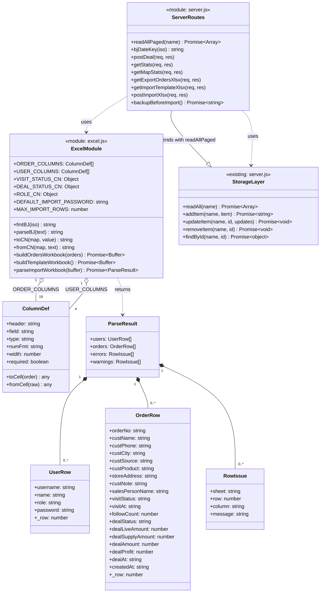
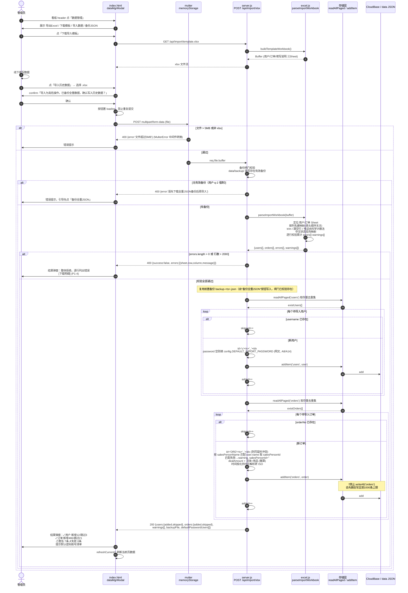
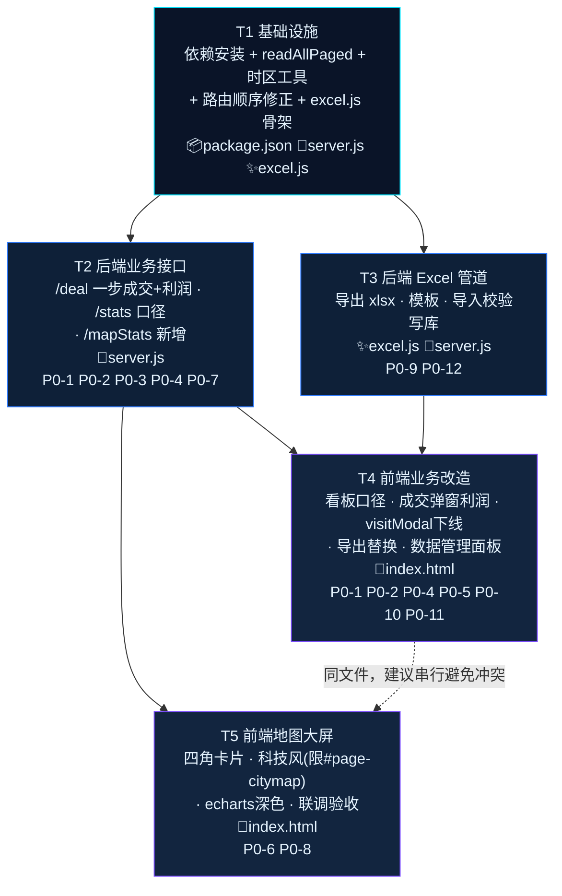

# 销售订单系统 — 增量架构设计文档

| 项 | 内容 |
| --- | --- |
| 文档类型 | 增量架构设计（Incremental System Design），非新建项目 |
| 上游输入 | `docs/PRD-增量-功能变更.md`（许清楚 / 产品经理 / v1.0） |
| 编写人 | 高见远（架构师） |
| 版本 | v1.1（对齐 PRD v1.1） |
| 下游 | 开发工程师 |
| 项目路径 | `D:\WB\sales-order-system` |
| 技术栈 | Node.js 22 + Express 4 单体，无构建工具；前端 `public/index.html` 单页内嵌 JS/CSS |

---

## 零、先行核查结论（阻塞项，已完成）

> 本章是本次设计的**技术地基**。PRD 的 A7/A8 两个高风险待确认项已通过代码核实并给出结论；核查过程中另外发现 **3 个 PRD 未预见的致命问题**，均已纳入设计。

### 0.1 【A8】密码存储方式 —— 结论：**明文存储，确认无疑**

| 证据位置 | 代码 | 结论 |
| --- | --- | --- |
| `server.js:465` 登录 | `users.find(u => u.username === username && u.password === password)` | 直接字符串比对，**无哈希** |
| `server.js:483` 建号 | `{ ..., password, ... }` 直接落库 | 明文写入 |
| `server.js:493` 改密 | `if (password) u.password = password;` | 明文写入 |
| `server.js:511` 自助改密 | `if (!u \|\| u.password !== oldPassword)` | 明文比对 |
| 全局检索 | 无 `bcrypt` / `crypto` / `scrypt` / `pbkdf2` 引用 | 无任何加密 |

**导入方案（不可偏离）**：

- 导入用户时 `password` 字段**必须明文写入**，与 `POST /api/users` 完全一致；**严禁**在导入链路单独引入哈希，否则导入的账号 100% 无法登录（登录是明文比对）。
- 模板「初始密码」列允许留空；留空时统一填入常量 `DEFAULT_IMPORT_PASSWORD = '123456'`，并在导入结果摘要中明确提示「N 个账号使用默认密码 123456，请通知用户首次登录后修改」。
- 导入用户的其余字段对齐 `POST /api/users` 的结构：`{ id: 'u'+ts+'_'+idx, username, password, role, name, phone: '', createdAt: ISO }`。
- **本期不做密码加密改造**（超出变更范围，且会导致全部存量账号失效）。但在文档中登记为技术债 **TD-1**，建议后续单独立项：加盐哈希 + 存量账号首次登录时透明升级。

### 0.2 【A7】导出分页上限 —— 结论：**存在硬性 1000 条截断，必须改造**

```js
// server.js:275  readAll() 的 CloudBase 分支
const res = await db.collection(name).limit(1000).get();
```

| 风险点 | 说明 |
| --- | --- |
| **静默截断** | CloudBase 模式下 `readAll('orders')` 单次最多返回 **1000 条**，第 1001 条起被**静默丢弃**，无任何报错。订单量一旦破千，导出、统计、看板、地图**全部失真** |
| 影响面远超导出 | `/api/stats`、`/api/cityStats`、`/api/orders`、新增的 `/api/mapStats` 与导入去重校验**全部依赖 `readAll`**，同样被截断 |
| `writeAll` 同病 | `server.js:301` 全量重写也是 `limit(1000)`，云端 `writeAll('orders')` 会**删掉前 1000 条再重写**，超出部分变成孤儿数据 → **本次导入实现严禁调用 `writeAll('orders')`** |
| 本地模式 | 本地 JSON 分支无上限，问题只在 CloudBase 模式暴露；`FORCE_LOCAL_STORAGE=1` 本地调试**测不出来**，极易漏网 |

**应对方案（T1 必做）**：在存储层新增 `readAllPaged(name)`，循环 `skip/limit` 拉全量。

```js
/**
 * 全量读取集合，绕过 CloudBase 单次 1000 条上限。
 * 本地模式直接委托 readAll；云端模式循环分页直到取尽。
 */
async function readAllPaged(name) {
  if (!db || name === 'suggestions') return readAll(name);
  const PAGE = 1000, MAX_PAGES = 100; // 安全上限 10 万条，防御死循环
  const out = [];
  for (let p = 0; p < MAX_PAGES; p++) {
    const res = await db.collection(name).skip(p * PAGE).limit(PAGE).get();
    const rows = res.data || [];
    out.push(...rows.map(i => (i.id ? i : { ...i, id: i._id })));
    if (rows.length < PAGE) return out;
  }
  console.error('readAllPaged 触达安全上限 ' + (MAX_PAGES * PAGE) + ' 条，数据可能不完整: ' + name);
  return out;
}
```

**调用约定**：导出、导入去重校验、`/api/mapStats`、`/api/stats`、`/api/cityStats` 一律改用 `readAllPaged`。高频的 `GET /api/orders` 本期保持 `readAll` 不动（避免引入性能回归），登记为技术债 **TD-3**。

### 0.3 ⚠️ 新发现 F4：`app.get('*')` 通配路由会吞掉所有新增 GET 接口（**最高优先级陷阱**）

```js
// server.js:651
app.get('*', (req, res) => res.sendFile(path.join(__dirname, 'public', 'index.html')));
// server.js:652
app.get('/healthz', (req, res) => res.status(200).send('ok'));  // ← 死路由，永远命中不了
```

- Express 按注册顺序匹配。`app.get('*')` 之后注册的任何 GET 路由**永远不会被执行**。
- `/healthz` 就是活生生的证据——它已经是一条**死路由**，健康检查实际返回的是 `index.html`（HTTP 200，所以一直没被发现）。
- **后果**：若工程师把 `GET /api/export/orders.xlsx` 写在文件末尾，浏览器下载到的将是 **`index.html` 的 HTML 内容**，Excel 打开显示乱码或**空白**——与用户抱怨的「导出为空白」现象完全一致。

**强制约束**：本次新增的 **3 个 GET 路由**（`/api/mapStats`、`/api/export/orders.xlsx`、`/api/import/template.xlsx`）**必须全部注册在 `server.js:651` 的 `app.get('*')` 之前**。建议在 `app.get('*')` 上方加醒目注释栏：

```js
// ============================================================
// ⚠️ 所有 API 路由必须注册在本行以上！
//    下方 app.get('*') 是 SPA 兜底，会吞掉其后注册的一切 GET 路由。
// ============================================================
```

顺手修复：把 `/healthz` 移到 `app.get('*')` 之前（1 行改动，零风险）。

### 0.4 ⚠️ 新发现 F5：「导出为空白」的**真实根因**（PRD 的 F1 判断需要更正）

PRD F1 判断为「财务角色完全没有导出入口」。**核查后不成立**——财务页 `server.js` 无关，前端 `public/index.html:192` **已经有**「导出Excel」按钮，绑定 `downloadFinanceOrders()`（`public/index.html:493-504`）。真实根因是这个函数本身：

```js
function downloadFinanceOrders(){
  const rows=[],tbl=document.getElementById('financeTbl');   // ← 从 DOM 表格抓数据
  ...
  html+='<table><tr><th>订单号</th><th>日期</th><th>客户</th><th>电话</th><th>城市</th><th>到店</th><th>销售</th><th>店铺</th><th>备注</th></tr>';
  a.href='data:application/vnd.ms-excel;charset=utf-8,\ufeff'+encodeURIComponent(html);
  a.download='订单列表'+...+'.xls'    // ← HTML 伪装成 .xls
}
```

| # | 缺陷 | 造成的用户感知 |
| --- | --- | --- |
| 1 | **抓 DOM 表格**，只有页面上渲染的 **9 列** | 金额、成交状态、**利润**、成交时间等详单列**一列都没有** → 「详单为空白」 |
| 2 | 数据源是待办列表，`loadFinanceFollow()` 已过滤 `dealStatus === null` | **已成交订单一条都导不出来**，而财务对账要的恰恰是已成交单 → 打开近乎空表 |
| 3 | 待办为空时 `rows` 为空数组 | 导出**只有表头的纯空白文件**（字面意义的空白） |
| 4 | HTML 伪装 `.xls` | Excel 弹「格式与扩展名不符」警告，部分环境直接拒绝打开 |

**结论**：变更 4 的正确做法**不是「新增入口」，而是「替换实现」**——保留 L192 的按钮与日期筛选器，把 `downloadFinanceOrders()` 的函数体整体换成调用后端 `GET /api/export/orders.xlsx`。此判断已同步产品经理。

### 0.5 ⚠️ 新发现 F6：服务端时区（影响「今日到店/今日成交」正确性）

- 所有时间以 `new Date().toISOString()` 写入，即 **UTC**。
- `/api/stats` 的 `isT()`（`server.js:623`）用 `dt.getFullYear()/getMonth()/getDate()`，取的是**服务器本地时区**。云托管容器默认 `TZ=UTC`，于是「今天」= UTC 今天，与北京时间**错开 8 小时**：北京时间 `00:00–08:00` 成交的订单会被算进「昨天」。
- 新增的「今日到店/今日成交」若照抄这个写法，会**直接继承这个 bug**，且大屏上一眼可见（早上开会时数字为 0）。

**方案（双保险）**：

1. 在 `server.js` 顶部统一提供 UTC+8 日期工具，`/api/mapStats` 与 Excel 时间格式化**一律使用**，不依赖容器时区：

```js
const TZ_OFFSET_MS = 8 * 60 * 60 * 1000; // Asia/Shanghai，无夏令时
/** 取 ISO 时间在北京时区的自然日，返回 'YYYY-MM-DD'；无效输入返回 '' */
function bjDateKey(iso) {
  if (!iso) return '';
  const t = new Date(iso).getTime();
  if (Number.isNaN(t)) return '';
  return new Date(t + TZ_OFFSET_MS).toISOString().slice(0, 10);
}
/** 格式化为北京时间 'YYYY-MM-DD HH:mm'，供 Excel 导出使用 */
function fmtBJ(iso) {
  if (!iso) return '';
  const t = new Date(iso).getTime();
  if (Number.isNaN(t)) return '';
  return new Date(t + TZ_OFFSET_MS).toISOString().slice(0, 16).replace('T', ' ');
}
```

2. 云托管服务同时配置环境变量 `TZ=Asia/Shanghai`（顺带修正存量 `/api/stats` 的口径偏差）。

### 0.6 核查副产品：变更 2 修复的是一个**已存在的线上 bug**

`public/index.html:466` 订单管理页**已经**给 `pending_visit` 订单渲染了「确认成交」按钮：

```js
if(o.visitStatus==='pending_visit'&&o.dealStatus===null&&(me.role==='admin'||me.role==='finance'))
  act+=`<button ... onclick="openDeal('${o.id}')">确认成交</button>`;
```

而后端 `server.js:607` 硬校验 `if (o.visitStatus !== 'visited') return 400 '未到店'`。→ **管理员/财务在订单管理页点这个按钮，必然弹「操作失败」**。变更 2 的 P0-3 放宽校验后，这个存量 bug 自动消失。工程师应知悉：此处**前端无需改动**，后端放宽即生效。

---

## 一、实现方案与框架选型

### 1.1 总体原则

| 原则 | 说明 |
| --- | --- |
| **沿用单体，零构建** | 继续 Express 单体 + `public/index.html` 内嵌 JS/CSS。**不引入 Vite/React/打包器**，保持「改完直接 `node server.js`」的部署体验 |
| **抽模块，控膨胀** | `server.js` 已 665 行。Excel 读写逻辑（列定义、映射、生成、解析）约 300+ 行，**必须抽到独立模块 `excel.js`**，`server.js` 只保留路由编排与权限 |
| **纯函数化** | `excel.js` 不依赖 Express / 存储层，只接收数组、返回 Buffer 或解析结果，便于单测与复用 |
| **导出导入同构** | 导出列与导入列共用**同一份常量** `ORDER_COLUMNS`，从机制上保证「导出→编辑→导回」闭环（验收标准 3） |
| **改动最小化** | 存量字段（`dealAmount`/`dealSupplyAmount`）不删不改；`POST /visit`、`GET /api/export`(JSON) 接口保留；仅前端下线入口 |

### 1.2 技术选型

| 需求 | 选型 | 版本 | 理由 |
| --- | --- | --- | --- |
| Excel 读 + 写 | **`exceljs`** | `^4.4.0` | 一个库同时覆盖导出与导入（`xlsx`/SheetJS 写样式能力弱、社区版有已知安全告警）；原生支持数字类型单元格、列宽、冻结首行、单元格格式；Node 22 兼容（纯 JS，无 native 编译） |
| 文件上传 | **`multer`** | `^2.0.1` | Express 官方生态标准件；`memoryStorage()` 内存接收即可，**不落磁盘**（云托管容器文件系统是临时的，落盘无意义且有泄漏风险）。**必须用 2.x**：1.x（含 `1.4.5-lts.1`）存在已披露的 DoS 漏洞，且 2.x 才明确支持 Node 22 |

```bash
npm install exceljs@^4.4.0 multer@^2.0.1
```

> **不新增**任何其他依赖。日期格式化、中文映射均为几行工具函数，不引 dayjs/moment。

### 1.3 文件清单

| 文件（相对路径） | 类型 | 改动说明 | 预估增量 |
| --- | --- | --- | --- |
| `package.json` | 改 | dependencies 增加 `exceljs`、`multer` | +2 行 |
| **`config.js`** | **新增** | 全局单一配置常量，**仅 `DEFAULT_IMPORT_PASSWORD = '123456'`（A14）**；被 `excel.js` 与 `server.js` 引用，禁止在别处硬编码 | +3 行 |
| **`excel.js`** | **新增** | Excel 能力模块：列定义常量（含 `ORDER_COLUMNS`/`USER_COLUMNS`）、中英映射、时间格式化、导出工作簿构建、模板构建、导入解析与校验；`DEFAULT_IMPORT_PASSWORD` **从 `config.js` 引入**，不在本模块硬编码 | ~330 行 |
| `server.js` | 改 | ① `readAllPaged` ② UTC+8 时间工具 ③ `/deal` 放宽校验+利润 ④ `/stats` 排序键 ⑤ 新增 4 个路由 ⑥ 路由顺序修正 | ~+130 行，改 ~8 行 |
| `public/index.html` | 改 | 看板口径、成交弹窗利润、visitModal 下线、复制迁移、导出替换、数据管理面板、地图大屏结构 + 科技风 CSS | ~+380 行，改 ~25 行 |
| `data/backup/` | 新增目录 | 导入前 JSON 备份落盘目录（仅本地模式生效，需 `.gitignore`） | — |
| `docs/设计-增量-功能变更.md` | 新增 | 本文档 | — |
| `docs/sequence-diagram.mermaid` | 新增 | 时序图源文件 | — |
| `docs/class-diagram.mermaid` | 新增 | 类图/模块图源文件 | — |

> **不新建** `public/citymap.css` 等外链文件——现有前端是单文件内嵌架构，拆文件反而破坏一致性且多一次 HTTP 请求。科技风 CSS 追加到 `index.html` 现有 `<style>` 末尾，**全部包在 `#page-citymap` 作用域内**。

### 1.4 架构分层

```
┌──────────────────────────── public/index.html (SPA) ────────────────────────────┐
│  page-dashboard   page-citymap(大屏)   page-orders   page-finance-follow  ...   │
│  dealModal(+利润)   dataMgrModal(新)   importResultModal(新)                     │
└───────────────────────────────────┬──────────────────────────────────────────────┘
                                    │ fetch / api()
┌───────────────────────────────────▼──────────────────────────────────────────────┐
│                        server.js  —  路由层 + 权限 (requireRole)                  │
│   /api/orders/:id/deal   /api/stats   /api/mapStats                              │
│   /api/export/orders.xlsx   /api/import/template.xlsx   /api/import/xlsx         │
│   ⚠️ 全部注册于 app.get('*') 之前                                                 │
└──────────┬───────────────────────────────────────────┬───────────────────────────┘
           │                                           │
┌──────────▼─────────────┐               ┌─────────────▼──────────────────────────┐
│  excel.js（新增·纯函数）│               │  存储抽象层（server.js 内，已存在）      │
│  ORDER_COLUMNS         │               │  readAll / readAllPaged(新) / addItem   │
│  USER_COLUMNS          │               │  updateItem / removeItem / findById     │
│  buildOrdersWorkbook   │               └─────────────┬──────────────────────────┘
│  buildTemplateWorkbook │                             │
│  parseImportWorkbook   │              ┌──────────────┴───────────────┐
└────────────────────────┘              │ CloudBase DB  │  data/*.json │
                                        └───────────────┴──────────────┘
```

---

## 二、接口设计

### 2.0 接口总览

| # | 方法 | 路径 | 权限 | 类型 | 对应 P0 |
| --- | --- | --- | --- | --- | --- |
| 1 | POST | `/api/orders/:id/deal` | admin, finance | **改** | P0-3, P0-4 |
| 2 | GET | `/api/stats` | admin | **改** | P0-1, P0-2 |
| 3 | GET | `/api/mapStats` | admin | **新** | P0-6, P0-7 |
| 4 | GET | `/api/export/orders.xlsx` | admin, **finance** | **新** | P0-9 |
| 5 | GET | `/api/import/template.xlsx` | admin | **新** | P0-11 |
| 6 | POST | `/api/import/xlsx` | admin | **新** | P0-12 |

> 未列出的接口（`/api/orders/:id/visit`、`/api/export` JSON、`/api/cityStats` 等）**一律不改**，保持向后兼容。

---

### 2.1 【改】`POST /api/orders/:id/deal` — 一步成交 + 利润落库

| 项 | 内容 |
| --- | --- |
| 权限 | `requireAuth` + `requireRole('admin','finance')`（不变） |
| 位置 | `server.js:604` 原地改造 |

**入参** `application/json`

| 字段 | 类型 | 必填 | 说明 |
| --- | --- | --- | --- |
| `dealStatus` | `'closed' \| 'not_closed'` | ✅ | 非法值返回 400 |
| `liveAmount` | number | closed 时必填 | 活体售卖金额，≥0 |
| `supplyAmount` | number | 否 | 用品金额，≥0，默认 0 |
| **`profit`** | number | 否 | **新增**。利润，**允许负数**（亏损单），默认 0 |
| `note` | string | 否 | 成交备注 |

**校验规则变更**

```js
// 变更前（server.js:607）
if (o.visitStatus !== 'visited') return res.status(400).json({ error: '未到店' });

// 变更后
const ALLOW_DEAL_FROM = ['pending_visit', 'visited'];
if (!ALLOW_DEAL_FROM.includes(o.visitStatus)) {
  return res.status(400).json({ error: o.visitStatus === 'not_visited' ? '客户未到店，不可成交' : '订单未报单，不可成交' });
}
if (o.dealStatus !== null) return res.status(400).json({ error: '已处理' });
if (!['closed','not_closed'].includes(dealStatus)) return res.status(400).json({ error: '无效成交状态' });
```

**写入逻辑**

```js
const now = new Date().toISOString();
o.dealStatus = dealStatus;
if (dealStatus === 'closed') {
  // Q2：成交即视为到店。A11：visitAt 已有值时不覆盖，保留原到店时间
  o.visitStatus = 'visited';
  if (!o.visitAt) o.visitAt = now;
  const live   = Number(liveAmount)   || 0;
  const supply = Number(supplyAmount) || 0;
  o.dealLiveAmount   = live;
  o.dealSupplyAmount = supply;
  o.dealProfit       = Number(profit) || 0;   // ★ 新增落库，允许负数
  o.dealAmount       = live + supply;         // A9：合计不含利润，语义不变
} else {
  // 未成交：不强制置 visited，金额清零，利润不写
  o.dealAmount = 0;
  o.dealLiveAmount = 0;
  o.dealSupplyAmount = 0;
}
o.dealAt = now;
o.dealNote = note || '';
await updateItem('orders', req.params.id, o);
```

**出参**：`{ success: true, order: {...} }`

**错误码**

| 状态 | error | 触发 |
| --- | --- | --- |
| 401 | 请先登录 | 未登录 |
| 403 | 无权限访问 | 角色非 admin/finance |
| 404 | 不存在 | 订单 ID 无效 |
| 400 | 订单未报单，不可成交 | `visitStatus === null` |
| 400 | 客户未到店，不可成交 | `visitStatus === 'not_visited'` |
| 400 | 已处理 | `dealStatus !== null` |
| 400 | 无效成交状态 | dealStatus 非法 |

> **注意**：`Number(profit) || 0` 对 `profit = 0` 与 `NaN` 都得 0，符合预期；负数正常保留（`Number(-500) || 0 === -500`）。

---

### 2.2 【改】`GET /api/stats` — 排行排序键改活体口径

仅 **2 处** 单点改动，其余不动：

```js
// ① server.js:633 趋势图 revenue 改活体（P0-1，卡片与趋势图口径对齐）
revenue: c.reduce((s,o) => s + (o.dealLiveAmount || 0), 0)

// ② server.js:636 排行排序键改活体（P0-2，避免金额列乱序）
ranking: Object.values(sm).sort((a,b) => b.liveRevenue - a.liveRevenue)
```

- `stats[period].liveRevenue` **已存在**（`server.js:630`），前端直接改读即可，**后端无需新增计算**。
- `ranking[].revenue` / `supplyRevenue` **字段保留返回**，供后续 P2 使用，仅不再作为排序键与主展示。
- 顺带把 `readAll('orders')` 改为 `readAllPaged('orders')`（A7）。

---

### 2.3 【新】`GET /api/mapStats` — 地图大屏一次性数据源

| 项 | 内容 |
| --- | --- |
| 权限 | `requireAuth` + `requireRole('admin')`（A6：本期维持 admin only） |
| 入参 | `?limit=5`（可选，TOP 榜条数，默认 5，上限 20） |
| 注册位置 | **必须在 `app.get('*')` 之前** |

**设计动机**：一个接口取代「`/api/cityStats` + `/api/stats` + 前端二次排序」的三段式，避免前端并发与排序键错配（F3）。

**关键逻辑**

```js
const orders = await readAllPaged('orders');
const today  = bjDateKey(new Date().toISOString());   // 北京时区自然日（F6）

// A1：今日到店 = visitStatus==='visited' 且 visitAt 落在北京今天
const todayVisited = orders.filter(o => o.visitStatus === 'visited' && bjDateKey(o.visitAt) === today).length;
// A2：今日成交 = dealStatus==='closed' 且 dealAt 落在北京今天
const todayClosed  = orders.filter(o => o.dealStatus === 'closed'  && bjDateKey(o.dealAt)  === today).length;

// 城市 TOP：按订单数倒序
const cm = {};
orders.forEach(o => { const c = o.custCity || '未知'; (cm[c] ||= { city: c, orders: 0, visited: 0, closed: 0 }); cm[c].orders++;
  if (o.visitStatus === 'visited') cm[c].visited++; if (o.dealStatus === 'closed') cm[c].closed++; });
const cityTop = Object.values(cm).sort((a,b) => b.orders - a.orders).slice(0, limit);

// 销售 TOP：★ 按订单总数 total 倒序（非 revenue），A12 不排除停用销售
const sm = {};
orders.forEach(o => { const k = o.salesPersonId || o.salesPersonName || '未知';
  (sm[k] ||= { id: o.salesPersonId || '', name: o.salesPersonName || '未知', total: 0, visited: 0, closed: 0, liveRevenue: 0 });
  sm[k].total++; if (o.visitStatus === 'visited') sm[k].visited++;
  if (o.dealStatus === 'closed') { sm[k].closed++; sm[k].liveRevenue += (o.dealLiveAmount || 0); } });
const salesTop = Object.values(sm).sort((a,b) => b.total - a.total).slice(0, limit);
```

**出参**

```json
{
  "todayVisited": 128,
  "todayClosed": 46,
  "cityTop":  [{ "city": "杭州", "orders": 328, "visited": 210, "closed": 96 }],
  "salesTop": [{ "id": "u1", "name": "张三", "total": 186, "visited": 120, "closed": 58, "liveRevenue": 432000 }],
  "updatedAt": "2026-02-11T02:30:00.000Z"
}
```

**错误码**：401 未登录 / 403 无权限。

> **`/api/cityStats` 保留不动**，地图热力图数据继续从它取（含 orders/visited/closed 三种 tab 切换）；`/api/mapStats` 只服务四角卡片。二者并行，互不影响。

---

### 2.4 【新】`GET /api/export/orders.xlsx` — 订单详单导出

| 项 | 内容 |
| --- | --- |
| 权限 | `requireAuth` + `requireRole('admin','finance')` ← **对 finance 开放**（P0-9） |
| 注册位置 | **必须在 `app.get('*')` 之前** |
| 响应 | `Content-Type: application/vnd.openxmlformats-officedocument.spreadsheetml.sheet`（xlsx 文件流） |

**入参（Query）**

| 参数 | 优先级 | 说明 |
| --- | --- | --- |
| `start` | **P0-9** | `YYYY-MM-DD`，按 `createdAt`（北京日）≥ start。**沿用旧实现 `downloadFinanceOrders` 的 `createdAt` 口径（L484-485），严禁改按 `dealAt` 过滤，否则财务使用习惯突变**（PM 提醒） |
| `end` | **P0-9** | `YYYY-MM-DD`，按 `createdAt`（北京日）≤ end。同上 |
| `dealStatus` | P1-5 | `closed` / `not_closed` / `pending`(=null) |
| `salesPersonId` | P1-5 | 指定销售 |

> ⚠️ **`start`/`end` 已提为 P0-9**：财务页现有日期筛选器 `fDateFrom`/`fDateTo` 保留，"替换实现"后必须仍能筛选，否则属功能倒退（PM 确认 2）。`dealStatus`/`salesPersonId` 仍走 P1-5。

**数据范围（权限收敛，与 `GET /api/orders` 保持一致）**

```js
let orders = await readAllPaged('orders');
if (req.session.user.role === 'finance') {
  orders = orders.filter(o => o.visitStatus === 'visited' || o.visitStatus === 'pending_visit');
}
// ★ 注意：不再过滤 dealStatus===null。财务需要导出已成交单做对账（F5 缺陷 2 的修正点）
orders = applyExportFilters(orders, req.query);
orders.sort((a,b) => new Date(b.createdAt) - new Date(a.createdAt));
```

> ⚠️ **两个反直觉口径（PM 确认 / 提醒）**：
> 1. **导出 ≠ 待办**：财务**导出接口不过滤 `dealStatus`**（F5 缺陷 2 修正，要对账必须含已成交单），这与 A10 待办口径 `(visited|pending_visit) && dealStatus===null` **故意不同**。工程师勿"顺手对齐"两个过滤条件。
> 2. **按 `createdAt` 过滤，不按 `dealAt`**：日期筛选沿用旧实现 `downloadFinanceOrders` 的 `createdAt.slice(0,10)` 口径（L484-485）；改为 `dealAt` 会改变财务使用习惯，属产品口径变更，需先与产品确认。

**导出列定义（19 列，`excel.js` 的 `ORDER_COLUMNS`）**

| # | 列名 | 字段 | 单元格类型 | 备注 |
| --- | --- | --- | --- | --- |
| 1 | 订单编号 | `orderNo` | 文本 | 导入唯一键 |
| 2 | 客户姓名 | `custName` | 文本 | 导入必填 |
| 3 | 客户电话 | `custPhone` | **强制文本** | `numFmt='@'`，防科学计数法/前导 0 丢失 |
| 4 | 城市 | `custCity` | 文本 | |
| 5 | 客户来源 | `custSource` | 文本 | |
| 6 | 意向产品 | `custProduct` | 文本 | |
| 7 | 到店门店 | `storeAddress` | 文本 | |
| 8 | 备注 | `custNote` | 文本 | |
| 9 | 销售人员 | `salesPersonName` | 文本 | 导入时按 name 反查用户 |
| 10 | 到店状态 | `visitStatus` | 文本 | 中文映射 |
| 11 | 到店时间 | `visitAt` | 文本 | `YYYY-MM-DD HH:mm`（北京时间） |
| 12 | 跟进次数 | `followCount` | **数字** | `numFmt='0'` |
| 13 | 成交状态 | `dealStatus` | 文本 | 中文映射 |
| 14 | 活体金额 | `dealLiveAmount` | **数字** | `numFmt='#,##0.00'` |
| 15 | 用品金额 | `dealSupplyAmount` | **数字** | 同上 |
| 16 | 合计金额 | `dealAmount` | **数字** | 同上；导入时**重算**不信任 |
| 17 | **利润** | `dealProfit` | **数字** | 同上；允许负数 |
| 18 | 成交时间 | `dealAt` | 文本 | `YYYY-MM-DD HH:mm` |
| 19 | 创建时间 | `createdAt` | 文本 | `YYYY-MM-DD HH:mm` |

> PRD 表格标题写「18 列」但实际列举 19 行，以 **19 列**为准（已与产品确认口径）。

**样式约定**：首行表头加粗 + 底色 `FFEFF3F9` + **冻结首行** + 自动列宽（按内容估算，上限 40 字符）+ 开启自动筛选。

**文件名**：`订单详单-YYYY-MM-DD.xlsx`，中文需 RFC 5987 编码：

```js
const fname = `订单详单-${bjDateKey(new Date().toISOString())}.xlsx`;
res.setHeader('Content-Disposition',
  `attachment; filename="orders.xlsx"; filename*=UTF-8''${encodeURIComponent(fname)}`);
res.setHeader('Content-Type', 'application/vnd.openxmlformats-officedocument.spreadsheetml.sheet');
const buf = await buildOrdersWorkbook(orders);
res.end(Buffer.from(buf));   // ★ 用 res.end 不用 res.send，避免 Express 对 Buffer 做二次处理
```

**错误码**：401 / 403 / 500（`{ error: '导出失败' }`，同时 `console.error` 记录堆栈）。

---

### 2.5 【新】`GET /api/import/template.xlsx` — 导入模板下载

| 项 | 内容 |
| --- | --- |
| 权限 | `requireAuth` + `requireRole('admin')` |
| 注册位置 | **必须在 `app.get('*')` 之前** |
| 响应 | xlsx 文件流，文件名 `历史数据导入模板.xlsx` |

**结构（A4：单文件双 Sheet）**

| Sheet | 名称 | 列 |
| --- | --- | --- |
| 1 | `用户` | 账号 / 姓名 / 角色 / 初始密码 |
| 2 | `订单` | 与 2.4 导出 19 列**完全同构** |
| 3 | `填写说明` | 只读说明页（规则、枚举值、注意事项） |

**`用户` Sheet 列定义（`USER_COLUMNS`）**

| # | 列名 | 字段 | 必填 | 校验 |
| --- | --- | --- | --- | --- |
| 1 | 账号 | `username` | ✅ | 非空；表内不重复；不与库内已有重复（重复则跳过） |
| 2 | 姓名 | `name` | ✅ | 非空 |
| 3 | 角色 | `role` | ✅ | **仅接受 `销售/财务`（或 `sales/finance`）**；填 `管理员/admin` → 报错（A13）。错误文案必须明确：「不支持导入管理员账号，请联系系统维护人员手动创建」，不得笼统报"角色非法" |
| 4 | 初始密码 | `password` | ❌ | **留空则填 `config.DEFAULT_IMPORT_PASSWORD`（= `123456`，A14 单一常量，见 `config.js`）** |

**示例行**：两个 Sheet 各写 1 行灰色斜体示例数据，并在「填写说明」中注明「导入前请删除示例行」；解析时对**完全等于示例内容**的行自动跳过（容错）。

---

### 2.6 【新】`POST /api/import/xlsx` — 历史数据导入

| 项 | 内容 |
| --- | --- |
| 权限 | `requireAuth` + `requireRole('admin')` |
| Content-Type | `multipart/form-data`，字段名 **`file`** |
| 中间件 | `multer({ storage: multer.memoryStorage(), limits: { fileSize: 5*1024*1024, files: 1 } }).single('file')` |
| 注册位置 | POST 路由，不受 `app.get('*')` 影响；但建议与其他新增路由放在一起 |

**处理流程（两阶段，Validate-then-Write）**

```
① 入口校验    文件存在 / 扩展名 .xlsx / MIME / ≤5MB
② 备份闸门★  写库前**必须**已存在有效全量备份：校验 `data/backup/` 下存在非空 `backup-*.json` 且备份时间晚于上一次成功导入；**无备份则整体拒绝 400「请先下载全量JSON备份后再导入」**（用户 q-2 强制，不再"提示不强制"）
③ 解析        exceljs 从 Buffer 加载；定位「用户」「订单」Sheet（按名匹配，缺失则跳过该类）
④ 表头映射    按列名（非顺序）建立 列名→字段 映射；trim；缺关键列 → 整体拒绝（P1-3）
⑤ 全量校验    逐行校验；空行跳过；累计 errors[]，任一 error → ★ 整体拒绝，零写入
⑥ 写用户      username 去重（表内 + 库内），跳过重复，addItem 逐条写
⑦ 写订单      orderNo 去重；按 salesPersonName 关联 user.name；addItem 逐条写
⑧ 返回摘要（含本次校验通过的 backupFile 路径，供审计回溯）
```

**行校验规则**

| 对象 | 规则 | 违反后果 |
| --- | --- | --- |
| 通用 | 全空行 → 跳过（不计数、不报错） | — |
| 通用 | 所有字符串 `trim()`；电话若被 Excel 存成数字，还原为整数字符串（去科学计数法） | — |
| 用户 | `账号`/`姓名` 必填 | **error**（行号+原因） |
| 用户 | `角色` ∈ {销售,财务,sales,finance}；填 `管理员`/`admin` 或非法值 | **error**，且对 `管理员/admin` 给出专属提示「不支持导入管理员账号，请联系系统维护人员手动创建」（A13） |
| 用户 | 表内 `账号` 重复 | **error**（重复定义歧义，必须让用户改） |
| 用户 | 库内已存在同 `账号` | **skip**（A3 合并新增） |
| 用户 | `初始密码` 留空 | **warning** + 填 `config.DEFAULT_IMPORT_PASSWORD`（= `123456`，A14 单一常量，见 `config.js`） |
| 订单 | `订单编号`/`客户姓名` 必填 | **error** |
| 订单 | 金额列非数字且非空 | **error** |
| 订单 | 状态中文不在映射表内且非空 | **error** |
| 订单 | 时间列格式无法解析且非空 | **error** |
| 订单 | 表内 `订单编号` 重复 | **error** |
| 订单 | 库内已存在同 `订单编号` | **skip** |
| 订单 | `销售人员` 匹配不到用户 `name` | **warning**：`salesPersonName` 存文本，`salesPersonId = ''` |
| 全局 | 有效数据行 > **2000** | **error**，整体拒绝，提示分批导入 |

**中文 → 枚举反向映射**（与导出严格对称）

```
到店状态：即将到店→pending_visit  已到店→visited  未到店→not_visited  未报单/空→null
成交状态：已成交→closed          未成交→not_closed                待确认/空→null
角色：    管理员→admin           销售→sales                        财务→finance
```

**ID 生成（防批量冲突，PRD 6.6）**

```js
// ★ 'ORD' + Date.now() 在同一毫秒的循环里会重复，必须带序号
const batchTs = Date.now();
const orderId = 'ORD' + batchTs + '_' + String(idx).padStart(4, '0');
const userId  = 'u'   + batchTs + '_' + String(idx).padStart(4, '0');
```

**订单字段补全规则**

- `dealAmount` = `活体 + 用品`（**重算，不信任表内合计列**，防手工改错）
- `visitAt`/`dealAt`/`createdAt`：解析 `YYYY-MM-DD HH:mm`（按**北京时间**解读）→ 转 ISO 存储；`createdAt` 空则填导入时刻
- 未在模板中出现的字段填默认值：`lastFollowAt: null`、`followNote: null`、`dealNote: ''`
- `followCount` 空则 0

**写库约束（❗硬性）**

- **必须**用 `addItem('orders', o)` 逐条写；**严禁**使用 `writeAll('orders', arr)` —— 云端 `writeAll` 会先删除现有文档再重写，且自身受 1000 条上限影响，将造成**不可逆数据丢失**（见 0.2）。
- 写入过程中若单条 `addItem` 失败，记入 `failed[]` 继续（校验已通过，此时中断反而产生半写入），最终在摘要中体现。

**出参**

```json
{
  "success": true,
  "backupFile": "data/backup/backup-1739241000000.json",
  "users":  { "added": 12, "skipped": 3, "failed": 0 },
  "orders": { "added": 486, "skipped": 21, "failed": 0 },
        "warnings": [{ "sheet": "订单", "row": 34, "message": "销售人员「王五」未匹配到账号，已存为文本" }],
        "defaultPasswordUsers": ["zhangsan", "lisi"]
}
```

> 📌 **A14 / P0-12 强约束**：前端 `importResultModal` **必须**显著展示 `defaultPasswordUsers` 清单并提示「请通知相关人员尽快修改密码」（P2-8 已规划"首次登录强制改密"，本期系统尚无此机制，故靠提示兜底）。缺失此提示视为验收不通过。

**校验失败（整体拒绝）**

```json
// HTTP 400
{
  "success": false,
  "error": "文件校验未通过，未写入任何数据",
  "errors": [
    { "sheet": "用户", "row": 5,  "column": "角色",     "message": "不支持导入管理员账号，请联系系统维护人员手动创建" },
    { "sheet": "订单", "row": 12, "column": "活体金额", "message": "金额必须为数字，当前值「一万二」" }
  ],
  "errorCount": 2
}
```

**错误码**

| 状态 | error | 触发 |
| --- | --- | --- |
| 400 | 请选择要导入的文件 | 无 file 字段 |
| 400 | 仅支持 .xlsx 格式 | 扩展名/MIME 不符 |
| 400 | 文件超过 5MB | multer LIMIT_FILE_SIZE |
| 400 | 文件解析失败，请确认为有效的 Excel 文件 | exceljs 抛错 |
| 400 | 未找到「用户」或「订单」工作表 | 两个 Sheet 都缺失 |
| 400 | 缺少必需列：XXX | 表头映射失败 |
| 400 | 单次导入不得超过 2000 行 | 超限 |
| 400 | 请先下载全量JSON备份后再导入 | 备份闸门：data/backup/ 无有效备份（用户 q-2 强制） |
| 400 | 文件校验未通过，未写入任何数据 | 存在 error 行 |
| 401/403 | 请先登录 / 无权限访问 | 权限 |
| 500 | 导入失败 | 未预期异常 |

> **`multer` 错误处理**：需在路由后挂错误中间件把 `MulterError`（如 `LIMIT_FILE_SIZE`）转为 400 JSON，否则 Express 默认返回 HTML 错误页，前端解析 JSON 失败会显示成"未知错误"。

---

### 2.7 `excel.js` 模块接口（类图）



---

## 三、程序调用流程（时序图）

### 3.1 链路一：财务一步成交（变更 2，P0-3 / P0-4 / P0-5）

```mermaid
sequenceDiagram
    autonumber
    actor F as 财务用户
    participant UI as index.html<br/>page-finance-follow
    participant M as dealModal<br/>(含利润输入)
    participant API as server.js<br/>POST /api/orders/:id/deal
    participant S as 存储层<br/>findById / updateItem
    participant DB as CloudBase / data JSON

    F->>UI: 打开「财务跟进」
    UI->>API: GET /api/orders
    API->>S: readAll('orders')
    S->>DB: query
    DB-->>S: orders[]
    S-->>API: orders[]
    API-->>UI: 过滤 visited/pending_visit
    UI->>UI: loadFinanceFollow() 渲染<br/>pending_visit 与 visited 统一渲染「已成交/未成交」按钮<br/>行内新增「复制信息」按钮（visitModal 已下线）

    F->>UI: 点击「已成交」
    UI->>M: openDeal(oid) 弹出价格栏
    M->>M: 展示 客户名 + 订单号<br/>活体 / 用品 / 利润 三输入
    F->>M: 输入 活体=12800 用品=2400 利润=3600
    M->>M: calcAmtTotal() 合计=15200（不含利润，只读）
    F->>M: 点击「确认成交」
    alt 利润为负数 (P1-7)
        M->>F: confirm「利润为负，确认提交？」
    end
    M->>API: POST {dealStatus:'closed', liveAmount, supplyAmount, profit, note}

    API->>S: findById('orders', id)
    S-->>API: order
    alt visitStatus 不在 [pending_visit, visited]
        API-->>M: 400 未报单 / 客户未到店
        M->>F: alert 错误提示
    else dealStatus 已非 null
        API-->>M: 400 已处理
    else 校验通过
        API->>API: visitStatus='visited'<br/>visitAt ||= now  (A11 不覆盖存量)<br/>dealStatus='closed'; dealAt=now<br/>dealLiveAmount / dealSupplyAmount<br/>dealProfit=profit  ★新增<br/>dealAmount=live+supply  (A9 不含利润)
        API->>S: updateItem('orders', id, order)
        S->>DB: update
        DB-->>S: ok
        S-->>API: ok
        API-->>M: 200 {success:true, order}
        M->>UI: closeM('dealModal'); refreshCurrent()
        UI->>F: 订单移出待办，状态「已到店 + 已成交」
    end
```

### 3.2 链路二：管理员 Excel 导入（变更 5，P0-11 / P0-12）



---

## 四、依赖包清单

| 包 | 版本 | 用途 | Node 22 兼容 | 备注 |
| --- | --- | --- | --- | --- |
| `exceljs` | `^4.4.0` | Excel 读 + 写（导出/模板/解析三处复用） | ✅ 纯 JS，无 native 编译 | 用 `workbook.xlsx.writeBuffer()` 出 Buffer；`workbook.xlsx.load(buffer)` 读内存 |
| `multer` | `^2.0.1` | multipart 文件上传（内存存储） | ✅ | **必须 2.x**：1.x（含 `1.4.5-lts.1`）存在已披露 DoS 漏洞；2.x 才明确声明支持 Node 22 |

**安装命令**

```bash
cd D:\WB\sales-order-system
npm install exceljs@^4.4.0 multer@^2.0.1
```

**`package.json` 变更后**

```json
"dependencies": {
  "express": "^4.18.2",
  "express-session": "^1.17.3",
  "@cloudbase/node-sdk": "^2.5.0",
  "exceljs": "^4.4.0",
  "multer": "^2.0.1"
}
```

> **部署提醒**：云托管镜像构建需重新 `npm install`；`exceljs` 会带入 `archiver`/`unzipper` 等传递依赖，镜像体积约 +8MB，可接受。
> **前端零新增依赖**：echarts 与 china.json 已本地化，科技风样式为纯 CSS，数字字体走系统字体栈降级（不引 Google Fonts，避免内网/离线环境加载失败导致数字乱跳）。

---

## 五、任务列表（有序，含依赖）

> 按**实现顺序**排列。每个任务内部再按 ① ② ③ 分步。T1 是所有任务的地基，必须最先完成。

### T1 — 项目基础设施：依赖安装 + 存储层分页 + excel.js 骨架

| 项 | 内容 |
| --- | --- |
| **优先级** | P0（阻塞全部） |
| **类型** | 依赖安装 + 后端 |
| **依赖** | 无 |
| **覆盖 PRD** | A7/P0-13 应对、A8/A14 应对、F4/F6 修复的前置 |
| **涉及文件** | `package.json`、`server.js`、**`excel.js`（新建）** |

**步骤**

1. `npm install exceljs@^4.4.0 multer@^2.0.1`，确认 `package.json` 与 `package-lock.json` 更新。
2. `server.js` 存储层新增 `readAllPaged(name)`（见 0.2 代码），紧跟 `readAll` 定义之后。
3. `server.js` 顶部新增 UTC+8 工具 `TZ_OFFSET_MS` / `bjDateKey(iso)` / `fmtBJ(iso)`（见 0.5）。
4. `server.js` 路由顺序整改：在 `app.get('*')` 上方加入警示注释栏；把 `/healthz` 移到 `app.get('*')` **之前**（顺手修死路由）。
5. 新建 `config.js`，导出**唯一**常量 `DEFAULT_IMPORT_PASSWORD = '123456'`（A14，单一事实来源）。新建 `excel.js`，导出常量与工具：`ORDER_COLUMNS`（19 列定义）、`USER_COLUMNS`（4 列）、`VISIT_STATUS_CN` / `DEAL_STATUS_CN` / `ROLE_CN` 双向映射表、`MAX_IMPORT_ROWS=2000`、`fmtBJ` / `parseBJ` / `toCN` / `fromCN`；`DEFAULT_IMPORT_PASSWORD` **从 `config.js` 引入**（`const { DEFAULT_IMPORT_PASSWORD } = require('./config')`），不在本模块硬编码。**本任务只出常量与纯工具函数，不写工作簿逻辑。**

**验收**：`node server.js` 正常启动；`curl /healthz` 返回 `ok`（而非 HTML）；`require('./excel')` 可正常加载并打印 19 列定义。

---

### T2 — 后端业务接口改造：一步成交 + 口径统一 + 地图数据源

| 项 | 内容 |
| --- | --- |
| **优先级** | P0 |
| **类型** | 后端 |
| **依赖** | **T1** |
| **覆盖 PRD** | **P0-1、P0-2、P0-3、P0-4、P0-7、P0-14**，A1/A2/A9/A11 |
| **涉及文件** | `server.js` |

**步骤**

1. **P0-3 + P0-4**：改造 `POST /api/orders/:id/deal`（`server.js:604`）——放宽校验至 `['pending_visit','visited']`；成交时一次性写 `visited`+`visitAt`（不覆盖存量）+`closed`+`dealAt`+`dealProfit`；`dealAmount = live + supply` 保持不变。详见 2.1。
2. **P0-1**：`/api/stats` 趋势图 `revenue` 累加源改 `dealLiveAmount`（`server.js:633`）。
3. **P0-2**：`/api/stats` `ranking` 排序键改 `b.liveRevenue - a.liveRevenue`（`server.js:636`）。
4. **P0-6 + P0-7 数据侧**：新增 `GET /api/mapStats`（详见 2.3），注册于 `app.get('*')` **之前**。今日口径用 `bjDateKey`，**严禁复用 `isT(o.createdAt)`**。
5. `/api/stats`、`/api/cityStats`、`/api/mapStats` 的 `readAll('orders')` 统一替换为 `readAllPaged('orders')`。

**验收**：对 `pending_visit` 订单调 `/deal` 返回 200 且库中 `visitStatus=visited`、`dealProfit` 有值；`not_visited` 订单仍返回 400；`/api/mapStats` 返回四项数据且 `salesTop` 按 `total` 倒序。

---

### T3 — 后端 Excel 管道：导出 / 模板 / 导入

| 项 | 内容 |
| --- | --- |
| **优先级** | P0 |
| **类型** | 后端 |
| **依赖** | **T1**（可与 T2 并行） |
| **覆盖 PRD** | **P0-9、P0-12**，P1-3、P1-5、P1-6，A3/A4/A7/A8/A13/A14 |
| **涉及文件** | `excel.js`、`server.js` |

**步骤**

1. `excel.js` 实现 `buildOrdersWorkbook(orders)`：按 `ORDER_COLUMNS` 生成工作表，金额/次数写**数字类型**并设 `numFmt`，电话列设 `numFmt='@'`，状态走中文映射，时间走 `fmtBJ`；表头加粗+底色+冻结首行+自动筛选+自适应列宽；返回 Buffer。
2. `excel.js` 实现 `buildTemplateWorkbook()`：三 Sheet（用户 / 订单 / 填写说明），各带 1 行示例数据与说明文案。
3. `excel.js` 实现 `parseImportWorkbook(buffer)`：Sheet 定位 → 按列名建表头映射（顺序无关）→ 逐行 trim/跳空行/电话还原/中文反向映射 → 逐行校验 → 返回 `{users, orders, errors, warnings}`。**只校验不写库**。
4. `server.js` 新增 `GET /api/export/orders.xlsx`（admin+finance，财务范围收敛但**不再过滤 dealStatus**，支持 `start/end/dealStatus/salesPersonId`），注册于 `app.get('*')` **之前**。
5. `server.js` 新增 `GET /api/import/template.xlsx`（admin），注册于 `app.get('*')` **之前**。
6. `server.js` 新增 `backupBeforeImport()`：`readAllPaged` 三集合 → 写 `data/backup/backup-<ts>.json`（目录不存在则 `mkdirSync recursive`）。该函数由「数据管理」面板「备份全量JSON」按钮调用，是导入的**前置条件**（用户 q-2 强制）。
7. `server.js` 新增 `POST /api/import/xlsx`（admin + multer memoryStorage 5MB）：**先过备份闸门**（校验 `data/backup/` 存在有效备份，否则 400「请先下载全量JSON备份后再导入」）→ 两阶段执行（先全量校验，全通过才写库）；`addItem` 逐条写；ID 带批次序号；**严禁 `writeAll('orders')`**；挂 MulterError → 400 JSON 的错误中间件。返回摘要含 `backupFile`。
8. 新建 `.gitignore` 条目 `data/backup/`。

**验收**：财务账号访问 `/api/export/orders.xlsx` 下载到真 xlsx，19 列齐全、状态中文、金额可直接 SUM；下载模板填 2 行后导入成功；把导出文件原样导回 → 提示「全部重复、跳过 N 条、新增 0 条」（验收标准 3）；故意写错一行角色 → 整体拒绝且给出行号。

---

### T4 — 前端业务改造：看板口径 + 一步成交 + 导出替换 + 数据管理

| 项 | 内容 |
| --- | --- |
| **优先级** | P0 |
| **类型** | 前端 |
| **依赖** | **T2、T3** |
| **覆盖 PRD** | **P0-1、P0-2、P0-4、P0-5、P0-10、P0-11**，A5、P1-7 |
| **涉及文件** | `public/index.html` |

**步骤**

1. **P0-1 / P0-2**：`loadDashboard()` 营收卡片改读 `stats[p].liveRevenue`，文案改「**活体营收**」；趋势图 revenue 系列同步；`rankTbl` 金额列改 `liveRevenue`，表头改「活体金额」。
2. **P0-4**：`dealModal`（L233-244）在「用品金额」下方新增「利润」输入 `<input id="dProfit" type="number" step="0.01">`（**允许负数，不设 min=0**）；`calcAmtTotal()` 保持只算活体+用品；`saveDeal()`（L388）新增 `profit` 入参；利润 < 0 时 `confirm` 二次确认（P1-7）；`openDeal()`（L387）重置 `dProfit` 并在标题区补展示订单号。
3. **P0-5**：`loadFinanceFollow()`（L480）操作列改造——`pending_visit` 与 `visited` **统一**渲染「已成交」主按钮 + 「未成交」次按钮，均走 `openDeal()`；移除 `openVisit()` 调用入口；行内新增「复制信息」按钮，新增 `copyOrderInfo(oid)`（从 `copyVisitInfo` L382 迁移逻辑，改为按 oid 取单）；`visitModal`（L225-230）HTML 与 `openVisit`/`saveVisit`/`copyVisitInfo` 保留在文件中但**不再被任何入口调用**（便于回滚，加注释 `// deprecated: 变更2 已下线入口`）。
4. **P0-10**：`downloadFinanceOrders()`（L493-504）**函数体整体替换**为调用 `GET /api/export/orders.xlsx`（带上 `fDateFrom`/`fDateTo` 作为 `start`/`end`），blob 下载，从 `Content-Disposition` 解析文件名并 fallback；失败时 alert。**保留 L192 按钮不动。**
5. **P0-11**：`switchPage()`（L290）admin 看板 header 增加「数据管理」按钮；新增 `dataMgrModal`（导出订单Excel / 下载导入模板 / 导入历史数据 / 备份全量JSON 四项）+ 隐藏 `<input type="file" accept=".xlsx">`；新增 `importResultModal` 展示摘要（新增/跳过/警告/失败 + 默认密码账号提示 + 错误行号列表）；**「备份全量JSON」为导入前置（用户 q-2 强制）：点该按钮调用 `GET` 落 `data/backup/` 后置 `importArmed=true`；未备份则禁用「导入历史数据」按钮并提示「请先备份」**。上传前 `confirm` 二次确认 + loading 态防重复提交。

**验收**：财务点「导出Excel」下载到非空 19 列 xlsx；`pending_visit` 订单一步成交成功且利润入库；财务页无「确认到店」按钮但「复制信息」可用；admin 数据管理四个按钮可用；sales 角色看不到任何导出/导入入口。

---

### T5 — 前端地图大屏：四角信息卡 + 科技风样式 + 整体联调

| 项 | 内容 |
| --- | --- |
| **优先级** | P0 |
| **类型** | 前端（含样式） |
| **依赖** | **T2**（需 `/api/mapStats`）；建议在 T4 之后做，避免同文件冲突 |
| **覆盖 PRD** | **P0-6、P0-8**，P1-1、P1-2、P1-8 |
| **涉及文件** | `public/index.html` |

**步骤**

1. **P0-8 结构**：重写 `page-citymap`（L172-180）——外层 `.citymap-stage { position:relative }` 铺满，地图容器 `#mapChart` `position:absolute; inset:0`；移除原「城市排行」独立 section（其内容并入右下/左下卡片）；tab 与全屏按钮改为底部居中悬浮条。
2. **P0-6 结构**：新增 4 个绝对定位卡片——左上 `#mapTodayVisited`（220×110）、右上 `#mapTodayClosed`（220×110）、左下 `#mapCityTop`（260×200）、右下 `#mapSalesTop`（260×200）；距边 24px，`z-index` 高于地图。
3. **P0-6 数据**：新增 `loadMapStats()` 调 `GET /api/mapStats`，渲染四角；在 `loadCityMap()`（L443）内并行调用（`Promise.all`，互不阻塞）；TOP 榜固定 5 条、超出内部滚动、前三名徽章渐变色。
4. **P0-8 样式**（❗**硬约束**）：科技风 CSS 追加到现有 `<style>` 末尾，**每一条选择器都必须以 `#page-citymap` 开头**；**严禁**声明或修改 `:root` / `--surface` / `--accent` 等全局 CSS 变量；如需自有变量，声明在 `#page-citymap { --cm-cyan: #00E5FF; ... }` 内。配色按 PRD 7.3。
5. **echarts 深色化**：`loadCityMap()` 的 `setOption` 中 `geo.itemStyle.areaColor` 改 `#0E2038`、`borderColor` 改 `#1E4A73`、`visualMap.inRange.color` 改 `['#0A3D62','#106A9B','#00B8D4','#00E5FF']`、`emphasis` 加青色外发光；`backgroundColor` 设透明由容器承载渐变。
6. **P1-8**：`@media (max-width: 900px)` 内（仍限定 `#page-citymap`）四角卡片改为静态流式上下堆叠。
7. **P1-1 / P1-2**（有余量再做）：卡片四角 L 型 HUD 切角、发光描边、数字滚动动效。
8. **整体联调**：跑通验收标准 1-5，重点回归**样式隔离**——切到看板/订单/账号管理页逐一对比改造前截图。

**验收**：地图绝对居中、四角数据准确、销售 TOP 按订单数倒序；切到其他页面样式与改造前**完全一致**（验收标准 4）；全屏模式布局比例不变。

---

### 任务依赖图



**并行建议**：T2 与 T3 可并行（都只改 `server.js` 不同区段，注意合并冲突）；T4 与 T5 都改 `public/index.html`，**强烈建议串行**。

**P0 覆盖自检**

| P0 | 任务 | P0 | 任务 |
| --- | --- | --- | --- |
| P0-1 | T2 + T4 | P0-8 | T5 |
| P0-2 | T2 + T4 | P0-9 | T3 + T4 |
| P0-3 | T2 | P0-10 | T4 |
| P0-4 | T2 + T4 | P0-11 | T4 |
| P0-5 | T4 | P0-12 | T3 |
| P0-6 | T2 + T5 | P0-13 | T1（A7 分页改造，技术前置） |
| P0-7 | T2 | P0-14 | T1 + T2（A1/A2 时区约束，技术前置） |

✅ P0-1 ~ P0-14 全覆盖（PRD v1.1 将 A7 升级为 P0-13、A1/A2 时区升级为 P0-14）。

---

## 六、共享知识（跨文件约定）

> 工程师**必须**遵守本章，这是保证「导出→导入闭环」与「样式不污染」的机制性前提。

### 6.1 单一事实来源：列定义常量

**所有** Excel 列相关逻辑（导出表头、模板表头、导入表头映射）**只能**引用 `excel.js` 的 `ORDER_COLUMNS` / `USER_COLUMNS`，**严禁**在任何地方硬编码列名字符串数组。这是验收标准 3（导出文件原样导回=全部重复）成立的唯一保障。

```js
// excel.js
const ORDER_COLUMNS = [
  { header: '订单编号',   field: 'orderNo',          type: 'text',  width: 20, required: true  },
  { header: '客户姓名',   field: 'custName',         type: 'text',  width: 12, required: true  },
  { header: '客户电话',   field: 'custPhone',        type: 'phone', width: 14, numFmt: '@'     },
  { header: '城市',       field: 'custCity',         type: 'text',  width: 10 },
  { header: '客户来源',   field: 'custSource',       type: 'text',  width: 10 },
  { header: '意向产品',   field: 'custProduct',      type: 'text',  width: 14 },
  { header: '到店门店',   field: 'storeAddress',     type: 'text',  width: 22 },
  { header: '备注',       field: 'custNote',         type: 'text',  width: 26 },
  { header: '销售人员',   field: 'salesPersonName',  type: 'text',  width: 10 },
  { header: '到店状态',   field: 'visitStatus',      type: 'enum',  width: 10, cnMap: 'VISIT' },
  { header: '到店时间',   field: 'visitAt',          type: 'date',  width: 18 },
  { header: '跟进次数',   field: 'followCount',      type: 'int',   width:  9, numFmt: '0' },
  { header: '成交状态',   field: 'dealStatus',       type: 'enum',  width: 10, cnMap: 'DEAL'  },
  { header: '活体金额',   field: 'dealLiveAmount',   type: 'money', width: 13, numFmt: '#,##0.00' },
  { header: '用品金额',   field: 'dealSupplyAmount', type: 'money', width: 13, numFmt: '#,##0.00' },
  { header: '合计金额',   field: 'dealAmount',       type: 'money', width: 13, numFmt: '#,##0.00', recalcOnImport: true },
  { header: '利润',       field: 'dealProfit',       type: 'money', width: 13, numFmt: '#,##0.00', allowNegative: true },
  { header: '成交时间',   field: 'dealAt',           type: 'date',  width: 18 },
  { header: '创建时间',   field: 'createdAt',        type: 'date',  width: 18 },
];
const USER_COLUMNS = [
  { header: '账号',     field: 'username', type: 'text', width: 16, required: true },
  { header: '姓名',     field: 'name',     type: 'text', width: 12, required: true },
  { header: '角色',     field: 'role',     type: 'enum', width: 10, cnMap: 'ROLE', required: true },
  { header: '初始密码', field: 'password', type: 'text', width: 14 },
];
```

### 6.2 状态中文映射（双向，放 `excel.js`，导出导入共用）

```js
const VISIT_STATUS_CN = { pending_visit: '即将到店', visited: '已到店', not_visited: '未到店', null: '未报单' };
const DEAL_STATUS_CN  = { closed: '已成交', not_closed: '未成交', null: '待确认' };
const ROLE_CN         = { admin: '管理员', sales: '销售', finance: '财务' };

/** 枚举值 → 中文；空/未知返回空映射项 */
function toCN(map, v) { return map[v === null || v === undefined || v === '' ? 'null' : v] ?? ''; }
/** 中文 → 枚举值；同时兼容直接填英文枚举；无法识别返回 undefined（调用方判为 error） */
function fromCN(map, text) {
  const t = String(text ?? '').trim();
  if (t === '') return null;
  const hit = Object.entries(map).find(([k, cn]) => cn === t || k === t);
  if (!hit) return undefined;
  return hit[0] === 'null' ? null : hit[0];
}
```

> **A14 常量落位**：`DEFAULT_IMPORT_PASSWORD` **不得**在 `excel.js` 内硬编码字面量；统一从 `config.js` 引入（`const { DEFAULT_IMPORT_PASSWORD } = require('./config')`）。`config.js` 是单一事实来源，改默认值只动一处。

> **对称性铁律**：`fromCN(map, toCN(map, v)) === v` 对所有枚举值成立。改动任一映射表**必须**同步验证这条恒等式。前端 badge 文案也须与此保持一致（现有前端已用相同中文，无需改）。

### 6.3 时间格式化（统一 UTC+8，禁用容器本地时区）

- **存储**：一律 ISO 8601 UTC（`new Date().toISOString()`），**不变**。
- **导出 / 展示 / 今日口径**：一律走 `fmtBJ(iso)` → `YYYY-MM-DD HH:mm`、`bjDateKey(iso)` → `YYYY-MM-DD`（见 0.5）。
- **导入解析** `parseBJ(text)`：把 `YYYY-MM-DD HH:mm` 或 `YYYY-MM-DD` 按**北京时间**解读，转回 ISO UTC 存储。

```js
function parseBJ(text) {
  const t = String(text ?? '').trim();
  if (!t) return null;
  const m = t.match(/^(\d{4})-(\d{1,2})-(\d{1,2})(?:[ T](\d{1,2}):(\d{2})(?::(\d{2}))?)?$/);
  if (!m) return undefined;                       // 无法解析 → 调用方判为 error
  const [, y, mo, d, h = '0', mi = '0', s = '0'] = m;
  return new Date(Date.UTC(+y, +mo - 1, +d, +h, +mi, +s) - TZ_OFFSET_MS).toISOString();
}
```

- **前端**沿用现有 `fmt()`（浏览器本地时区），不改动。
- 云托管服务建议配置 `TZ=Asia/Shanghai`（双保险，顺带修正存量 `/api/stats` 口径）。

### 6.4 金额与数字单元格

| 约定 | 说明 |
| --- | --- |
| 写入类型 | 金额/次数**必须**写 JS `number`，**绝不**写 `'¥12,800'` 字符串，否则 Excel 无法 SUM |
| 空值 | `null`/`undefined` 写 `0`（而非空串），保证整列同类型可求和 |
| 数字格式 | 金额 `#,##0.00`；次数 `0` |
| 负数 | **仅 `dealProfit` 允许负数**；其余金额列导入时 `< 0` 判为 error |
| 电话列 | `numFmt='@'` 强制文本；导入时若读到 `number`，用 `String(BigInt(v))` 或 `v.toFixed(0)` 还原，防科学计数法（P1-3） |
| 合计列 | `dealAmount` 导出照写库值；**导入时忽略表内值，用 `活体 + 用品` 重算**（`recalcOnImport: true`） |
| 利润与合计 | **A9 铁律**：`dealAmount = dealLiveAmount + dealSupplyAmount`，**利润永不参与合计**。任何地方都不得改这个语义 |

### 6.5 样式作用域（❗最高优先级硬约束）

```css
/* ✅ 正确：所有选择器以 #page-citymap 开头，自有变量声明在其内部 */
#page-citymap { --cm-bg1:#050B18; --cm-cyan:#00E5FF; --cm-blue:#2E7BFF; --cm-text:#E6F4FF; --cm-text2:#7A9CC6; }
#page-citymap .cm-card { background:rgba(10,20,40,.72); backdrop-filter:blur(8px);
  border:1px solid rgba(0,229,255,.28); box-shadow:0 0 12px rgba(0,229,255,.35), inset 0 0 24px rgba(0,229,255,.06); }
#page-citymap .cm-num { font-family:'Orbitron','DIN Alternate','Bebas Neue',ui-monospace,monospace;
  text-shadow:0 0 10px rgba(0,229,255,.65); }
@media (max-width:900px){ #page-citymap .cm-card { position:static; } }

/* ❌ 禁止：污染全局，会串改看板/订单/账号管理所有页面 */
:root { --accent:#00E5FF; }
.card { background:#0A1428; }
.tab.active { color:#00E5FF; }
```

**三条禁令**

1. **禁止**声明或覆写 `:root` 下的任何 CSS 变量（`--surface`、`--surface2`、`--accent`、`--text`、`--text2`、`--text3`、`--border`、`--green`、`--red`、`--rs` 等）。
2. **禁止**出现任何不以 `#page-citymap` 开头的新增选择器（含 `@media` 内部）。
3. **禁止**修改现有全局类（`.card` `.section` `.tab` `.btn` `.badge` `.modal` …）的既有规则；地图页需要不同外观时，在 `#page-citymap` 作用域内**覆盖**而非**修改**。

**自检方法**：新增 CSS 块用 `/* ===== CITYMAP TECH THEME (scoped) ===== */` 与 `/* ===== END CITYMAP ===== */` 包裹，逐行确认每条选择器都含 `#page-citymap`。改造完成后逐页对比截图（验收标准 4）。

### 6.6 后端通用约定

| 约定 | 说明 |
| --- | --- |
| **路由注册位置** | ⚠️ 所有新增 **GET** 路由必须在 `server.js` 的 `app.get('*')` **之前**注册（F4），否则返回 HTML 而非 xlsx |
| 权限中间件 | 沿用 `requireAuth` + `requireRole(...roles)`，**不新造**权限机制 |
| 错误响应 | 统一 `{ error: '中文提示' }` + 恰当 HTTP 状态码（与现有风格一致，**不引入** `{code,data,message}` 包装，避免前端 `api()` 全量改造） |
| 导入接口例外 | `POST /api/import/xlsx` 因需返回结构化明细，用 `{ success, users, orders, warnings, errors }`，前端单独处理 |
| 全量读取 | 导出、导入去重、统计类接口一律 `readAllPaged`；**严禁**在这些场景用 `readAll`（A7） |
| 批量写库 | **严禁** `writeAll('orders'|'users', arr)`；一律 `addItem` 逐条（0.2） |
| 批量 ID | `'ORD'/'u' + batchTs + '_' + String(idx).padStart(4,'0')`，防同毫秒冲突 |
| 密码 | **明文**存储，与 `POST /api/users` 一致；导入留空填 `config.DEFAULT_IMPORT_PASSWORD`（A8/A14，单一常量置于 `config.js`，**禁止**在 `excel.js`/`server.js` 硬编码 `123456`） |
| 文件下载头 | `Content-Disposition: attachment; filename="ascii.xlsx"; filename*=UTF-8''<encodeURIComponent(中文名)>` |
| Buffer 响应 | 用 `res.end(Buffer.from(buf))`，不用 `res.send()` |
| multer 错误 | 需挂 `MulterError` → 400 JSON 的错误中间件，否则返回 HTML 错误页 |

### 6.7 前端通用约定

| 约定 | 说明 |
| --- | --- |
| 请求封装 | JSON 接口沿用现有 `api(method, url, body)`；**文件下载不能用它**（它做 `res.json()`），需裸 `fetch` + `blob` |
| 下载封装 | 新增统一 `downloadBlob(url, fallbackName)`：`fetch(url,{credentials:'same-origin'})` → 非 2xx 时读 JSON 报错 → `blob()` → `URL.createObjectURL` → `a.click()` → **`URL.revokeObjectURL`**（现有 `exportData()` L513 漏了 revoke，一并补上） |
| 高危操作 | 导入前 `confirm` 二次确认；提交期间按钮 `disabled` + loading 文案，防重复提交 |
| 刷新 | 操作成功后调 `refreshCurrent()`（L515），不手写页面刷新 |
| 废弃代码 | `visitModal` 相关（HTML L225-230、`openVisit` L380、`saveVisit` L381、`copyVisitInfo` L382）**保留但断开入口**，加 `// deprecated: 变更2 已下线入口，接口 POST /visit 仍保留` 注释，便于回滚 |
| 角色可见性 | 导出入口：admin + finance；导入入口：**仅 admin**；sales 一律不可见（验收标准 5） |

---

## 七、待明确事项与架构决策

### 7.1 A1–A12 架构师拍板结论

| 编号 | 事项 | 架构决策 | 说明 |
| --- | --- | --- | --- |
| **A1** | 今日到店定义 | ✅ **采纳 PRD 推荐**，并**强化**：`visitStatus==='visited'` 且 `bjDateKey(visitAt) === 今天` | 必须用**北京时区**判定（F6），不能用容器本地时区，否则每天 00:00–08:00 数据错位 |
| **A2** | 今日成交定义 | ✅ 采纳：`dealStatus==='closed'` 且 `bjDateKey(dealAt) === 今天` | 同上 |
| **A3** | 覆盖 or 合并 | ✅ **合并新增 + 跳过重复**，本期**不做**覆盖选项 | 云端 `writeAll` 的删后写行为叠加 1000 条上限（0.2），覆盖模式在当前存储层下是**不安全**的，技术上就不该提供 |
| **A4** | 模板 Sheet 结构 | ✅ **单文件双 Sheet**，并**追加第三个「填写说明」只读 Sheet** | 说明页承载枚举值与规则，可显著降低导入报错率 |
| **A5** | 数据管理入口位置 | ✅ 看板页 header「数据管理」按钮 → 弹出面板 | 改动最小，不新增导航项（`buildNav` 无需改） |
| **A6** | 地图对 finance 开放 | ✅ **维持 admin only** | 与 `/api/cityStats` 现状一致；投屏需求走 P2-3 |
| **A7** | 导出数据量上限 | ⚠️ **核查结论：存在 1000 条硬截断，必须改造** | 详见 **0.2**。新增 `readAllPaged` 循环分页；导出/导入/统计全部改用；`writeAll` 同病，故禁用于批量写 |
| **A8** | 导入密码处理 | ⚠️ **核查结论：现有为明文存储** | 详见 **0.1**。导入必须明文写入；留空填 `config.DEFAULT_IMPORT_PASSWORD`（`123456`）；结果摘要列出默认密码账号；加密改造登记为 TD-1 |
| **A9** | 利润是否进合计 | ✅ **不参与**，`dealAmount = 活体 + 用品` 语义不变 | 已写入 6.4 作为铁律 |
| **A10** | 财务待办口径 | ✅ 维持 `(pending_visit \| visited) && dealStatus===null`（现有 L482 已如此），**不改** | 但**导出接口不受此过滤**——财务要导已成交单对账（F5 缺陷 2） |
| **A11** | 存量"已到店未成交" | ✅ 成交时 `if (!o.visitAt) o.visitAt = now`，**不覆盖**原到店时间 | 已写入 2.1 |
| **A12** | 销售 TOP 排除停用 | ✅ **不排除** | 用户表无启用/停用字段（`GET /api/users` 返回 `id/username/role/name/phone/createdAt`），现在做需先加字段，超范围 |
| **A13** | 导入模板角色列 | ✅ **仅接受 销售/财务**（或 `sales/finance`），**禁止管理员** | 风险不对称：误填/被篡改一行即获最高权限，代价是全量数据泄露；admin 靠 seed 带出，本就不该走批量通道。填 `管理员/admin` 报错文案必须明确写「不支持导入管理员账号，请联系系统维护人员手动创建」（PM PRD 8.1） |
| **A14** | 默认密码 | ✅ **沿用 `123456`，但抽为 `config.js` 单一常量 `DEFAULT_IMPORT_PASSWORD`** | 明文存储现状下纠结复杂度属次要敞口（TD-1 才是根因）；一线人员口头/微信告知，复杂密码增沟通成本。三条硬要求：① 单一常量 ② 摘要输出默认密码账号清单 ③ 结果弹窗显著提示改密；"首次登录强制改密"补为 P2-8 |

### 7.2 新增技术决策（PRD 未覆盖）

| 编号 | 事项 | 决策 |
| --- | --- | --- |
| **B1** | Excel 逻辑放哪 | 抽独立模块 `excel.js`（纯函数，不依赖 Express/存储层）；`server.js` 仅挂路由。避免 665 行文件继续膨胀 |
| **B2** | 导出/导入是否共用列定义 | **强制共用** `ORDER_COLUMNS`（6.1）。这是验收标准 3 成立的机制保障 |
| **B3** | 上传文件是否落盘 | **不落盘**，`multer.memoryStorage()`。云托管容器文件系统临时，落盘无意义且有残留风险 |
| **B4** | 导入备份是否强制 | **强制**（用户 q-2 拍板）：写库前必须已存在 `data/backup/backup-<ts>.json` 有效备份，否则 `POST /api/import/xlsx` 整体拒绝。「数据管理」面板「备份全量JSON」按钮调用 `backupBeforeImport()` 写入，导入路由以"备份闸门"校验其存在。云托管容器重建即丢失，故每次导入前都需重新备份（闸门自然强制这一点）。摘要返回 `backupFile` 供审计 |
| **B5** | 错误响应格式 | 沿用现有 `{ error }` 风格，**不引入** `{code,data,message}`，避免前端 `api()` 全量改造引入回归风险 |
| **B6** | 数字字体是否引外链 | **不引** Google Fonts，用系统字体栈降级。内网/离线环境加载失败会导致数字宽度跳动 |
| **B7** | `/healthz` 死路由 | 顺手修复（移到 `app.get('*')` 之前），1 行改动、零风险 |
| **B8** | `POST /visit` 接口 | **保留**，仅前端下线入口。用于历史数据修正与 admin 兜底 |

### 7.3 遗留技术债（本期不做，建议后续立项）

> 编号与 PRD v1.1 技术债表对齐：**TD-1（密码明文）、TD-2（users 硬编码 role）为共享项**；TD-3~TD-6 为本设计补充，供后续跟踪。

| 编号 | 技术债 | 风险等级 | 说明 |
| --- | --- | --- | --- |
| **TD-1** | 密码明文存储 | **高** | 建议加盐哈希 + 存量账号首次登录透明升级。本期改动会导致全部存量账号失效，不可在增量需求中夹带（PRD 共享项） |
| **TD-2** | `POST /api/users` 硬编码 `role:'sales'` | **中** | 界面连财务账号都建不了（PM 在 PRD 登记）；本期不修，但**导入模板已显式禁止管理员**（A13），不扩大该缺口 |
| **TD-3** | `GET /api/orders` 仍受 1000 条上限 | **中** | 高频接口，改分页有性能影响，建议配合前端分页/虚拟滚动一并改造 |
| **TD-4** | `writeAll` 云端"先删后写" | **中** | 非原子操作，中途失败会丢数据。本期以"禁用于批量写"规避 |
| **TD-5** | `/api/stats` today 口径依赖容器时区 | **中** | 本期通过 `TZ=Asia/Shanghai` 环境变量缓解；彻底修复需把 `isT/isW/isM` 全改为 `bjDateKey` |
| **TD-6** | `orderNo` 生成依赖 `orders.length` | **中** | `server.js:535` 用 `orders.length+1` 作序号，删单后会产生重复编号；叠加 1000 条上限后更易冲突。建议改为当日计数或随机后缀 |

### 7.4 需要用户/产品确认的开放问题

> 以下 3 项均已拍板：前 2 项与产品经理（PRD v1.1）对齐，第 3 项由用户 q-2 直接拍板（导入强制先备份）。

1. ~~**导入用户的角色范围**~~ ✅ **已拍板（A13）**：模板「角色」列**仅接受 销售/财务**，填管理员报错并给出专属提示。理由见 PRD 8.1。
2. ~~**默认密码值**~~ ✅ **已拍板（A14）**：沿用 `123456`，但抽为 `config.js` 单一常量 `DEFAULT_IMPORT_PASSWORD`；导入摘要输出默认密码账号清单；结果弹窗显著提示改密；"首次登录强制改密"补为 P2-8。
3. ~~**备份下载**~~ ✅ **已拍板（用户 q-2）：导入强制先备份**。写库前**必须**已完成全量 JSON 备份（`GET /api/export` 或「数据管理」面板「备份全量JSON」按钮写入 `data/backup/backup-<ts>.json`）；`POST /api/import/xlsx` 以"备份闸门"校验其存在，**无备份则整体拒绝 400「请先下载全量JSON备份后再导入」**。不再"提示不强制"。

---

## 八、验收对照表

| 验收标准（PRD 第九章） | 覆盖任务 | 关键验证点 |
| --- | --- | --- |
| 1. 口径一致性（卡片/趋势/排行 = 活体） | T2 + T4 | 三处同时间口径数字完全一致 |
| 2. 流程完整性（报单→一步成交含利润→导出有利润列） | T2 + T3 + T4 | 全链路跑通，xlsx 第 17 列有值 |
| 3. 数据闭环（导出原样导回 = 全部重复） | T3 | 依赖 `ORDER_COLUMNS` 单一来源（6.1） |
| 4. 样式隔离（其他页面与改造前一致） | T5 | 逐页截图对比；CSS 选择器全含 `#page-citymap` |
| 5. 权限正确（finance 可导出不可导入 / sales 全无 / admin 全有） | T3 + T4 | 三种角色分别登录验证 |
| 6. **P0-13 分页**：订单量 > 1000 时导出/统计/导入去重条数正确（`readAllPaged` 绕开截断） | T1 | 临时造数或单测验证循环分页 |
| 7. **P0-14 时区**：北京时间 00:30「今日到店/今日成交」数字正确，不归到"昨天" | T1 + T2 | 容器 `TZ=UTC` 下验证 `bjDateKey` 口径 |

> PRD v1.1 验收标准已由 5 条扩至 **10 条**（新增 5 条回归验证点，含 P0-13 分页、P0-14 时区、样式隔离强化、导入角色校验、默认密码提示等）。上表按任务对齐关键验证点；完整逐条对照见 PRD v1.1 第九章。

### 补充回归清单（易漏）

- [ ] `curl -I /api/export/orders.xlsx` 返回的 `Content-Type` 是 xlsx **而非 `text/html`**（F4 陷阱）
- [ ] 订单量 > 1000 时导出条数正确（A7；可临时造数或本地模式验证 `readAllPaged` 逻辑）
- [ ] 导入的账号能**正常登录**（A8 明文验证）
- [ ] 北京时间 00:30 时「今日到店」数字正确（F6 时区验证）
- [ ] 订单管理页对 `pending_visit` 订单点「确认成交」不再报「未到店」（0.6 存量 bug）
- [ ] `/healthz` 返回 `ok` 而非 HTML（B7）
- [ ] 利润填负数可成功提交且导出为负数（P1-7）
- [ ] 导入 6MB 文件返回 400 JSON **而非 HTML 错误页**（multer 错误中间件）

---

*文档结束。工程师实施前请先通读第零章（核查结论）与第六章（共享知识），这两章包含全部"踩坑点"与硬约束。*
